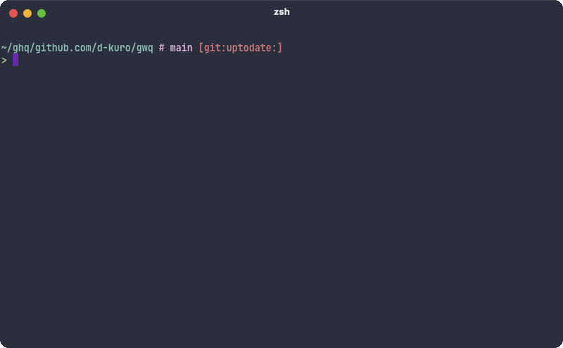

# gwq - Git Worktree Manager

`gwq` is a CLI tool for efficiently managing Git worktrees. Like how `ghq` manages repository clones, `gwq` provides intuitive operations for creating, switching, and deleting worktrees using a fuzzy finder interface.



## Why gwq?

Git worktrees allow you to check out multiple branches from the same repository into separate directories. This is particularly powerful when:

- Working on multiple features simultaneously
- Running parallel AI coding agents on different tasks
- Reviewing code while developing new features
- Testing changes without disrupting your main workspace

### AI Coding Agent Workflows

One of the most powerful applications of `gwq` is enabling parallel AI coding workflows. Instead of having a single AI agent work sequentially through tasks, you can leverage multiple worktrees to have multiple AI agents (like Claude Code) work on different parts of your project simultaneously:

```bash
# Create worktrees for parallel development
gwq add feature/authentication
gwq add feature/data-visualization
gwq add bugfix/login-issue

# Each AI agent can work in its own worktree
cd ~/worktrees/myapp-feature-authentication && claude
cd ~/worktrees/myapp-feature-data-visualization && claude
cd ~/worktrees/myapp-bugfix-login-issue && claude
```

Since each worktree has its own working directory with isolated files, AI agents can work at full speed without waiting for each other's changes or dealing with merge conflicts. This approach is ideal for:

- **Independent tasks**: Each AI agent focuses on a separate feature or component
- **Parallel migrations**: Multiple agents can migrate different parts of your codebase simultaneously
- **Code review workflows**: One agent writes code while another reviews it in a separate worktree
- **Testing isolation**: Run tests in one worktree while developing in another

## Installation

### Using Go
```bash
go install github.com/d-kuro/gwq/cmd/gwq@latest
```

### From Source
```bash
git clone https://github.com/d-kuro/gwq.git
cd gwq
go build -o gwq ./cmd/gwq
```

## Quick Start

```bash
# Create a new worktree with new branch
gwq add -b feature/new-ui

# List all worktrees
gwq list

# Get worktree path
gwq get

# Remove a worktree
gwq remove feature/old-ui
```

## Features

- **Fuzzy Finder Interface**: Built-in fuzzy finder for intuitive branch and worktree selection
- **Smart Navigation**: Quick switching between worktrees with pattern matching
- **Global Worktree Management**: Access all your worktrees across repositories from anywhere
- **Tab Completion**: Full shell completion support for branches, worktrees, and configuration
- **Configuration Management**: Customize worktree directories and naming conventions
- **Preview Support**: See branch details and recent commits before selection
- **Clean Operations**: Automatic cleanup of deleted worktree information
- **Branch Management**: Optional branch deletion when removing worktrees
- **Home Directory Display**: Option to display paths with `~` instead of full home directory path

## Global Worktree Management

`gwq` automatically discovers all worktrees in your configured base directory, allowing you to access them from anywhere on your system:

- **Outside Git Repositories**: When you run `gwq list` outside a git repository, it automatically discovers and shows all worktrees in the configured base directory
- **Inside Git Repositories**: By default, shows only worktrees for the current repository. Use the `-g` flag to see all worktrees from the base directory
- **Automatic Discovery**: All worktrees in the base directory are automatically discovered, including those created with native git commands
- **No Registry Required**: Uses filesystem scanning instead of maintaining a separate registry file

This feature is particularly useful when:
- Managing multiple projects simultaneously
- Quickly jumping between different repositories' worktrees
- Getting an overview of all active development branches across projects

**Note**: All worktrees located in the configured base directory (default: `~/worktrees`) are automatically discovered, regardless of how they were created.

## Commands

### `gwq add`

Create a new worktree

```bash
# Create worktree with new branch
gwq add -b feature/new-ui

# Create from existing branch
gwq add main  # Creates worktree from existing 'main' branch

# Create at specific path with new branch
gwq add -b feature/new-ui ~/projects/myapp-feature

# Create from remote branch
gwq add -b feature/api-v2 origin/feature/api-v2

# Interactive branch selection with fuzzy finder
gwq add -i
```

### `gwq list`

Display all worktrees

```bash
# Simple list
gwq list
# Output:
# BRANCH        PATH
# ● main        ~/ghq/github.com/user/project
# feature/api   ~/worktrees/github.com/user/project/feature-api
# bugfix/login  ~/worktrees/github.com/user/project/bugfix-login

# Detailed information
gwq list -v

# JSON format for scripting
gwq list --json

# Show all worktrees from base directory (from anywhere)
gwq list -g
```


### `gwq get`

Get worktree path

```bash
# Get path and change directory
cd $(gwq get feature)

# Get path for specific worktree
gwq get main

# Use with other commands
ls -la $(gwq get feature)

# Use null-terminated output with xargs
gwq get -0 feature | xargs -0 -I {} echo "Path: {}"

# Get path from global worktrees
gwq get -g myapp:feature
```

### `gwq exec`

Execute command in worktree directory

```bash
# Run tests in feature branch
gwq exec feature -- npm test

# Pull latest changes in main branch
gwq exec main -- git pull

# Run multiple commands
gwq exec feature -- sh -c "git pull && npm install && npm test"

# Stay in worktree directory after command
gwq exec --stay feature -- npm install

# Execute in global worktree
gwq exec -g myapp:feature -- make build

# Interactive selection with fuzzy finder (when multiple matches)
gwq exec feature -- npm test  # Shows fuzzy finder if multiple feature/* branches exist

# Select from all worktrees with fuzzy finder
gwq exec -- npm test  # Shows all worktrees in fuzzy finder
```

### `gwq remove`

Delete worktree

```bash
# Select and delete using fuzzy finder
gwq remove

# Delete by pattern
gwq remove feature/old

# Force delete
gwq remove -f feature/broken

# Delete worktree and branch together
gwq remove -b feature/completed

# Force delete branch even if not merged
gwq remove -b --force-delete-branch feature/abandoned

# Preview what would be deleted
gwq remove --dry-run -b feature/old

# Remove from any worktree in base directory (from anywhere)
gwq remove -g myapp:feature/old
```

**Branch Deletion Options:**
- By default, `gwq remove` only deletes the worktree directory, preserving the branch
- Use `-b/--delete-branch` to also delete the branch after removing the worktree
- The branch deletion uses safe mode (`git branch -d`) by default, which prevents deletion of unmerged branches
- Use `--force-delete-branch` with `-b` to force delete even unmerged branches (`git branch -D`)

### `gwq prune`

Clean up deleted worktree information

```bash
gwq prune
```

### `gwq config`

Manage configuration

```bash
# Show configuration
gwq config list

# Set worktree base directory
gwq config set worktree.basedir ~/worktrees

# Set naming template
gwq config set naming.template "{{.Repository}}-{{.Branch}}"
```

### `gwq version`

Display version information

```bash
# Show detailed version information
gwq version

# Show brief version
gwq --version
```

## Shell Integration

### Tab Completion

`gwq` provides tab completion for all commands, making it easy to discover branches, worktrees, and configuration options.

#### Setup

**Bash:**
```bash
# Add to ~/.bashrc
source <(gwq completion bash)
```

**Zsh:**
```bash
# Add to ~/.zshrc
source <(gwq completion zsh)
```

**Fish:**
```bash
# Save completion script
gwq completion fish > ~/.config/fish/completions/gwq.fish
```

**PowerShell:**
```powershell
# Add to your PowerShell profile
gwq completion powershell | Out-String | Invoke-Expression
```

After setting up, you can use tab completion:
```bash
gwq add <TAB>          # Shows available branches
gwq get <TAB>          # Shows available worktrees
gwq remove <TAB>       # Shows branches and worktrees
gwq config set <TAB>   # Shows configuration keys
```


## Configuration

Configuration file location: `~/.config/gwq/config.toml`

```toml
[worktree]
# Base directory for creating worktrees
basedir = "~/worktrees"
# Automatically create directories
auto_mkdir = true

[finder]
# Enable preview window
preview = true
# Preview window size
preview_size = 3

[naming]
# Directory name template
# Available variables: Host, Owner, Repository, Branch, Hash
template = "{{.Host}}/{{.Owner}}/{{.Repository}}/{{.Branch}}"
# Invalid character replacement (applied to branch names)
sanitize_chars = { "/" = "-", ":" = "-" }

[ui]
# Color output
color = true
# Icon display
icons = true
# Display home directory as ~ in paths
tilde_home = true
```

## Advanced Usage

### Multiple AI Agent Workflow

```bash
# Create multiple worktrees for parallel development
gwq add -b feature/auth
gwq add -b feature/api
gwq add -b bugfix/login

# Launch AI agents in parallel (example with Claude Code)
# Method 1: Using gwq get
# Terminal 1
cd $(gwq get auth) && claude

# Terminal 2
cd $(gwq get api) && claude

# Terminal 3
cd $(gwq get login) && claude

# Method 2: Using gwq exec --stay
# Terminal 1
gwq exec --stay auth -- claude

# Terminal 2
gwq exec --stay api -- claude

# Terminal 3
gwq exec --stay login -- claude

# Method 3: Using direct cd with gwq get
# Terminal 1
cd $(gwq get auth) && claude

# Terminal 2
cd $(gwq get api) && claude

# Terminal 3
cd $(gwq get login) && claude
```

### Batch Operations

```bash
# List all feature branches from global worktrees
gwq list -g --json | jq '.[] | select(.branch | contains("feature"))'

# Clean up old feature worktrees
gwq list -g --json | \
  jq -r '.[] | select(.branch | contains("feature/old-")) | .branch' | \
  xargs -I {} gwq remove -g {}
```

### Integration with Git Workflows

```bash
# Create worktree for PR review
gwq add -b pr-123-review origin/pull/123/head

# Create worktree for hotfix
gwq add -b hotfix/critical-bug origin/main

# Switch between worktrees quickly
cd $(gwq get)  # Use fuzzy finder to select
```

### Version Information

```bash
# Show version information
gwq version

# Show brief version
gwq --version
```

## Directory Structure

`gwq` organizes worktrees using a URL-based hierarchy similar to `ghq`, ensuring no naming conflicts:

```
~/worktrees/
├── github.com/
│   ├── user1/
│   │   └── myapp/
│   │       ├── main/           # Main branch
│   │       ├── feature-auth/   # Authentication feature
│   │       └── feature-api/    # API development
│   └── user2/
│       └── myapp/              # Same repo name, different user
│           ├── main/
│           └── develop/
├── gitlab.com/
│   └── company/
│       └── project/
│           └── feature-x/
└── code.google.com/
    └── p/
        └── vim/
            └── main/
```

This structure:
- **Prevents conflicts**: Same repository names from different sources don't collide
- **Preserves context**: You always know which repository a worktree belongs to
- **Scales naturally**: Works with any number of git hosting services
- **Follows conventions**: Similar to how `ghq` manages repository clones

## Requirements

- Git 2.5+ (for worktree support)
- Go 1.24+ (for building from source)
- Terminal with Unicode support (for fuzzy finder)

## Contributing

Contributions are welcome! Please feel free to submit a Pull Request.

## License

Apache License 2.0 - see [LICENSE](LICENSE) file for details.
