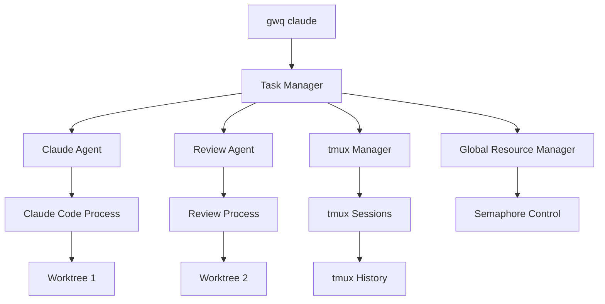
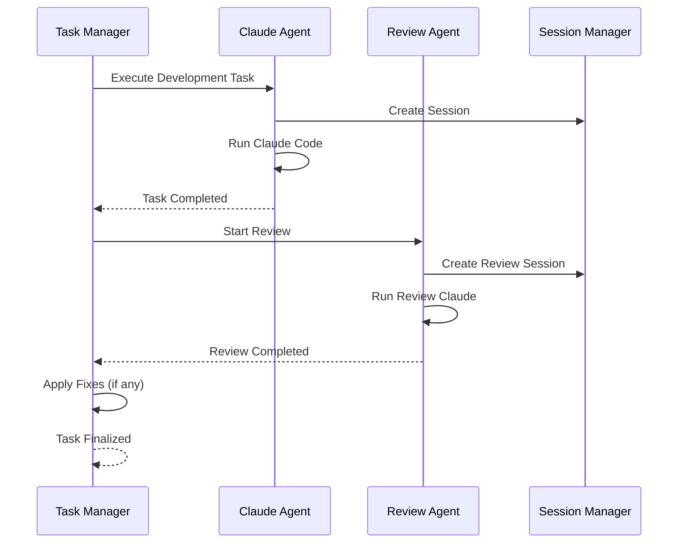

# Claude Task Queue Design

## Overview

Design for an automated task queue system with Claude Code integration. This system enables developers to leverage idle time (such as during sleep) to automatically execute tasks with Claude Code and complete code reviews.

The design is Claude Code-focused while maintaining extensibility for future AI agents (Cursor, GitHub Copilot, etc.).

## Core Concepts

### Git Worktree-First Design

- **Repository Root Execution**: All `gwq claude` commands executed from git repository root
- **Automatic Worktree Management**: Tasks always use git worktrees for isolation
- **Dedicated Commands**: All functionality provided through `gwq claude` subcommands
- **Automatic Review**: Automatically execute code reviews upon task completion
- **tmux Integration**: Process persistence using tmux session management
- **Parallelism Control**: System-wide Claude Code parallel execution control

### Future Extensibility

```go
// Agent interface for future extensibility
type Agent interface {
    Name() string
    Execute(ctx context.Context, task *Task) (*Result, error)
    HealthCheck() error
    Capabilities() []Capability
}

// Claude Code implementation
type ClaudeAgent struct {
    config *ClaudeConfig
    session *tmux.Session
}

// Future agents
type CursorAgent struct { /* ... */ }
type CopilotAgent struct { /* ... */ }
```

## Architecture

### Overall Structure



### Data Model

```go
type Task struct {
    ID           string            `json:"id"`
    Name         string            `json:"name"`
    Branch       string            `json:"branch"`              // Target branch for worktree
    Priority     Priority          `json:"priority"`
    Status       Status            `json:"status"`
    CreatedAt    time.Time         `json:"created_at"`
    StartedAt    *time.Time        `json:"started_at,omitempty"`
    CompletedAt  *time.Time        `json:"completed_at,omitempty"`
    
    // Git worktree information (required)
    RepositoryRoot   string            `json:"repository_root"`        // Git repository root path
    WorktreePath     string            `json:"worktree_path"`          // Dedicated worktree path for this task
    WorktreeName     string            `json:"worktree_name"`          // Worktree identifier
    
    SessionID    string            `json:"session_id,omitempty"`
    AgentType    string            `json:"agent_type"`
    
    // Enhanced task definition based on Claude Code best practices
    Context              string            `json:"context"`                // Background and problem description
    Objectives           []string          `json:"objectives"`             // Clear, measurable goals
    Instructions         string            `json:"instructions"`           // Detailed implementation guidance
    Constraints          []string          `json:"constraints"`            // Limitations and requirements
    FilesToFocus         []string          `json:"files_to_focus"`         // Key files to work on (relative to worktree)
    VerificationCommands []string          `json:"verification_commands"`  // Commands to verify success (run in worktree)
    
    // Task configuration
    Config TaskConfig `json:"config"`
    
    // Results
    Result       *TaskResult       `json:"result,omitempty"`
    ReviewResult *ReviewResult     `json:"review_result,omitempty"`
}

type TaskConfig struct {
    SkipPermissions bool          `json:"skip_permissions"`
    Timeout         string        `json:"timeout"`
    MaxIterations   int           `json:"max_iterations"`
    AutoReview      bool          `json:"auto_review"`
    AutoCommit      bool          `json:"auto_commit"`
    BackupFiles     bool          `json:"backup_files"`
}

type Priority int
const (
    PriorityLow    Priority = 0
    PriorityNormal Priority = 1
    PriorityHigh   Priority = 2
    PriorityUrgent Priority = 3
)

type Status string
const (
    StatusPending     Status = "pending"
    StatusRunning     Status = "running"
    StatusReviewing   Status = "reviewing"
    StatusCompleted   Status = "completed"
    StatusFailed      Status = "failed"
)

type TaskResult struct {
    ExitCode     int              `json:"exit_code"`
    Duration     time.Duration    `json:"duration"`
    FilesChanged []string         `json:"files_changed"`
    CommitHash   string           `json:"commit_hash,omitempty"`
}

type ReviewResult struct {
    Issues       []ReviewIssue    `json:"issues"`
    FixesApplied []string         `json:"fixes_applied"`
    Summary      string           `json:"summary"`
}
```

## Command Design

### gwq claude subcommands

#### `gwq claude task`

Task management functionality (following existing patterns):

```bash
# Add tasks (executed from repository root)
gwq claude task add -b feature/auth "Authentication system implementation"
  # → Creates worktree at .worktrees/feature-auth-<task-id>
gwq claude task add -b feature/api "REST API implementation" -p high
  # → Creates worktree at .worktrees/feature-api-<task-id>
gwq claude task add -f tasks.yaml  # Batch registration from YAML
  # → Creates worktrees for each task

# Task list (status command pattern)
gwq claude task list

# Output:
# TASK          BRANCH        WORKTREE                    STATUS      PRIORITY   DURATION
# ● auth-impl   feature/auth  .worktrees/feature-auth-abc running     normal     45m
#   api-dev     feature/api   .worktrees/feature-api-def  pending     high       -
#   bug-fix     bugfix/login  .worktrees/bugfix-login-ghi completed   urgent     2h 15m

# Detailed information
gwq claude task list --verbose
gwq claude task list --json
gwq claude task list --csv

# Filter and sort
gwq claude task list --filter running
gwq claude task list --sort priority --reverse

# Real-time monitoring
gwq claude task list --watch

# Specific task details
gwq claude task show auth-impl
gwq claude task show auth  # Pattern matching
gwq claude task show       # Fuzzy finder
```

#### `gwq claude worker`

Worker management:

```bash
# Start worker
gwq claude worker start
gwq claude worker start --parallel 3

# Check worker status
gwq claude worker status

# Output:
# Worker Status: Running
# Active Tasks: 2/3
# Queue: 5 pending
# Sessions: 2 running, 1 reviewing

# Stop worker
gwq claude worker stop

# Check configuration
gwq claude worker config
```

#### `gwq claude tmux`

tmux session management (delegates to generic tmux commands):

```bash
# Session list (filtered for Claude sessions)
gwq tmux list --context claude

# Attach to Claude session (pattern matching)
gwq tmux attach claude-auth
gwq tmux attach --context claude  # Fuzzy finder for Claude sessions

# Terminate Claude session
gwq tmux kill claude-auth
gwq tmux kill --context claude --status completed
```

#### `gwq claude review`

Review functionality:

```bash
# Check review results
gwq claude review show auth-impl

# Output:
# Review Summary for auth-impl:
# Status: Completed
# Issues Found: 3 (1 error, 2 warnings)
# Fixes Applied: 2
# 
# Issues:
# [ERROR] auth.go:45 - SQL injection vulnerability
# [WARN]  auth.go:78 - Missing error handling
# [INFO]  auth_test.go:23 - Test coverage improvement

# Review list
gwq claude review list
gwq claude review list --filter error

# Manual review execution
gwq claude review run auth-impl
```

#### `gwq claude start/stop`

Direct execution commands (executed from repository root):

```bash
# Start Claude with structured task (creates worktree)
gwq claude start --task-file task.yaml
  # → Creates worktree and executes Claude inside it

# Quick start with inline context (from repository root)
gwq claude start -b feature/bugfix \
  --objective "Fix all failing tests" \
  --verify "make test" \
  --constraint "Don't modify public APIs"
  # → Creates .worktrees/feature-bugfix-<id>/ and runs Claude there

# Start with existing worktree
gwq claude start -b feature/auth \
  --context "$(cat docs/auth-spec.md)" \
  --objective "Complete JWT authentication" \
  --verify "make test" \
  --verify "make security-scan"
  # → Uses existing .worktrees/feature-auth-*/ or creates new one

# List running Claude instances (shows worktree paths)
gwq claude list

# Output:
# TASK         BRANCH        WORKTREE                    STATUS     DURATION
# auth-impl    feature/auth  .worktrees/feature-auth-abc running    45m
# api-dev      feature/api   .worktrees/feature-api-def  running    1h 20m

# Stop Claude
gwq claude stop auth
gwq claude stop --all

# Cleanup specific worktree
gwq claude cleanup auth-impl
  # → Removes .worktrees/feature-auth-abc/
```

## Automatic Review Feature

### Review Flow



### Review Configuration

```toml
[claude.review]
# Enable automatic review
enabled = true

# Review targets
review_patterns = ["*.go", "*.js", "*.ts", "*.py"]
exclude_patterns = ["*_test.go", "vendor/*"]

# Review prompt
review_prompt = """
Please focus on reviewing the following points:
1. Security vulnerabilities
2. Bugs and potential issues
3. Performance concerns
4. Code readability
5. Missing tests

If fixes are needed, please apply them automatically.
"""

# Automatic fixes
auto_fix = true
max_fix_attempts = 3
```

## Parallelism Control and Resource Management

### Global Parallelism Control

```go
type ResourceManager struct {
    maxClaude          int
    maxDevelopment     int  
    maxReview         int
    activeDevelopment int
    activeReview      int
    semaphore         *Semaphore
}

func (r *ResourceManager) AcquireSlot(taskType TaskType) (*Slot, error) {
    switch taskType {
    case TaskTypeDevelopment:
        if r.activeDevelopment >= r.maxDevelopment {
            return nil, ErrSlotUnavailable
        }
    case TaskTypeReview:
        if r.activeReview >= r.maxReview {
            return nil, ErrSlotUnavailable
        }
    }
    return r.semaphore.Acquire(), nil
}
```

### Configuration

```toml
[claude]
# Claude Code executable
executable = "claude"
default_args = []

# Global parallelism control
max_parallel = 5
max_development_tasks = 3
max_review_tasks = 2

# Resource limits
max_cpu_percent = 80
max_memory_mb = 4096
task_timeout = "2h"

[claude.queue]
# Queue management
max_queue_size = 100
queue_dir = "~/.gwq/claude/queue"

# Priority processing
priority_boost_after = "1h"
starvation_prevention = true

[claude.tmux]
# tmux session configuration
auto_create_session = true
session_prefix = "gwq-claude"
history_limit = 50000
```

## Agent Abstraction Design

### Agent Interface

```go
// Agent abstraction for future extensions
type Agent interface {
    // Basic information
    Name() string
    Version() string
    Capabilities() []Capability
    
    // Task execution
    Execute(ctx context.Context, task *Task) (*TaskResult, error)
    Review(ctx context.Context, task *Task) (*ReviewResult, error)
    
    // Health check
    HealthCheck() error
    IsAvailable() bool
    
    // Session management
    CreateSession(task *Task) (*Session, error)
    AttachSession(sessionID string) error
}

type Capability string

const (
    CapabilityCodeGeneration Capability = "code_generation"
    CapabilityCodeReview     Capability = "code_review"
    CapabilityTesting        Capability = "testing"
    CapabilityRefactoring    Capability = "refactoring"
    CapabilityDocumentation  Capability = "documentation"
)

// Claude Code implementation
type ClaudeAgent struct {
    config      *ClaudeConfig
    sessionMgr  *SessionManager
    resourceMgr *ResourceManager
}

func (c *ClaudeAgent) Name() string { return "claude" }

func (c *ClaudeAgent) Execute(ctx context.Context, task *Task) (*TaskResult, error) {
    // Ensure worktree exists for the task
    if err := c.ensureWorktree(task); err != nil {
        return nil, fmt.Errorf("failed to prepare worktree: %w", err)
    }
    
    // Build Claude Code command with automation flags
    cmd := c.buildCommand(task)
    
    // Create tmux session for persistent execution in worktree
    session, err := c.sessionMgr.CreateSession(ctx, SessionOptions{
        Context:    "claude",
        Identifier: fmt.Sprintf("%s-%s", task.Branch, task.ID),
        WorkingDir: task.WorktreePath,  // Execute Claude inside worktree
        Command:    cmd,
        Metadata: map[string]string{
            "task_id":      task.ID,
            "task_name":    task.Name,
            "branch":       task.Branch,
            "worktree":     task.WorktreePath,
            "repo_root":    task.RepositoryRoot,
        },
    })
    if err != nil {
        return nil, fmt.Errorf("failed to create session: %w", err)
    }
    
    // Monitor execution and handle results
    result, err := c.monitorExecution(ctx, session, task)
    if err != nil {
        return nil, err
    }
    
    return result, nil
}

func (c *ClaudeAgent) ensureWorktree(task *Task) error {
    // Check if worktree already exists
    if _, err := os.Stat(task.WorktreePath); err == nil {
        return nil // Worktree already exists
    }
    
    // Create new worktree from repository root
    cmd := exec.Command("git", "worktree", "add", task.WorktreePath, task.Branch)
    cmd.Dir = task.RepositoryRoot
    
    if err := cmd.Run(); err != nil {
        // If branch doesn't exist, create it
        createBranchCmd := exec.Command("git", "worktree", "add", "-b", task.Branch, task.WorktreePath)
        createBranchCmd.Dir = task.RepositoryRoot
        if err := createBranchCmd.Run(); err != nil {
            return fmt.Errorf("failed to create worktree with new branch: %w", err)
        }
    }
    
    return nil
}

func (c *ClaudeAgent) buildCommand(task *Task) string {
    args := []string{
        c.config.Executable,
        "--dangerously-skip-permissions",
        "--json-output",
    }
    
    // Add timeout if specified
    if task.Config.Timeout != "" {
        args = append(args, "--timeout", task.Config.Timeout)
    }
    
    // Add max iterations
    if task.Config.MaxIterations > 0 {
        args = append(args, "--max-iterations", strconv.Itoa(task.Config.MaxIterations))
    }
    
    // Add task context as a comprehensive prompt
    prompt := c.buildTaskPrompt(task)
    args = append(args, "--task", prompt)
    
    return strings.Join(args, " ")
}

func (c *ClaudeAgent) buildTaskPrompt(task *Task) string {
    var prompt strings.Builder
    
    prompt.WriteString(fmt.Sprintf("# Task: %s\n\n", task.Name))
    
    if task.Context != "" {
        prompt.WriteString(fmt.Sprintf("## Context\n%s\n\n", task.Context))
    }
    
    if len(task.Objectives) > 0 {
        prompt.WriteString("## Objectives\n")
        for _, obj := range task.Objectives {
            prompt.WriteString(fmt.Sprintf("- %s\n", obj))
        }
        prompt.WriteString("\n")
    }
    
    if task.Instructions != "" {
        prompt.WriteString(fmt.Sprintf("## Instructions\n%s\n\n", task.Instructions))
    }
    
    if len(task.Constraints) > 0 {
        prompt.WriteString("## Constraints\n")
        for _, constraint := range task.Constraints {
            prompt.WriteString(fmt.Sprintf("- %s\n", constraint))
        }
        prompt.WriteString("\n")
    }
    
    if len(task.FilesToFocus) > 0 {
        prompt.WriteString("## Files to Focus On\n")
        for _, file := range task.FilesToFocus {
            prompt.WriteString(fmt.Sprintf("- %s\n", file))
        }
        prompt.WriteString("\n")
    }
    
    if len(task.VerificationCommands) > 0 {
        prompt.WriteString("## Verification Commands\n")
        prompt.WriteString("Please run these commands to verify your work:\n")
        for _, cmd := range task.VerificationCommands {
            prompt.WriteString(fmt.Sprintf("- `%s`\n", cmd))
        }
        prompt.WriteString("\n")
    }
    
    prompt.WriteString("## Success Criteria\n")
    prompt.WriteString("Task is complete when:\n")
    prompt.WriteString("- All objectives are met\n")
    prompt.WriteString("- All verification commands pass\n")
    prompt.WriteString("- Code follows project conventions\n")
    prompt.WriteString("- No security issues introduced\n")
    
    return prompt.String()
}

func (c *ClaudeAgent) Capabilities() []Capability {
    return []Capability{
        CapabilityCodeGeneration,
        CapabilityCodeReview,
        CapabilityTesting,
        CapabilityRefactoring,
        CapabilityDocumentation,
    }
}
```

### Future Extension Examples

```bash
# Future support for other agents
gwq cursor task add -b feature/ui "UI implementation"
gwq copilot task add -b feature/api "API implementation"

# Agent-specific features
gwq claude review run task-123
gwq cursor pair-programming start
gwq copilot suggest improvements

# Integrated view
gwq agent list
gwq agent status --all
```

## Integration and Workflow

### Integration with Existing Commands

```bash
# Integration with existing gwq commands (executed from repository root)

# Create worktree and Claude task together
gwq add -b feature/auth --with-claude-task "Authentication system implementation"
  # → Creates worktree AND registers Claude task

# Display Claude information in status command
gwq status --verbose

# Output:
# BRANCH            STATUS       CHANGES        ACTIVITY      CLAUDE TASKS
# ● main            clean        -             2 hours ago   -
#   feature/auth    changed      5 added, 3 mod running       auth-impl (.worktrees/feature-auth-abc)
#   feature/api     clean        -             pending       api-dev (queued)
# 
# Claude Worktrees:
# .worktrees/feature-auth-abc123   running   auth-impl        1h 25m
# .worktrees/feature-api-def456    pending   api-dev          -
```

### Task File Format

```yaml
# tasks.yaml (executed from repository root)
version: "1.0"
default_config:
  skip_permissions: true
  timeout: "2h"
  auto_review: true
  max_iterations: 3
  worktree_base: ".worktrees"        # Relative to repository root

tasks:
  - id: "auth-system-impl"
    name: "Authentication System Implementation"
    branch: "feature/auth"              # Target branch for worktree
    priority: high
    
    # Worktree will be created at: .worktrees/feature-auth-auth-system-impl/
    
    # Clear context and objectives
    context: |
      We need to implement a JWT-based authentication system for our web application.
      The existing codebase uses Go with Gin framework and PostgreSQL database.
      
    objectives:
      - "Implement secure JWT token generation and validation"
      - "Create login/logout endpoints with proper error handling"
      - "Add middleware for route protection"
      - "Write comprehensive tests with >90% coverage"
      - "Update API documentation"
    
    # Specific instructions and constraints
    instructions: |
      Please implement the authentication system following these guidelines:
      
      1. **Security Requirements:**
         - Use RS256 for JWT signing
         - Implement proper password hashing with bcrypt
         - Add rate limiting for login attempts
         - Include CSRF protection
      
      2. **Code Structure:**
         - Follow existing project patterns in `internal/auth/`
         - Use the existing database connection pool
         - Implement proper error handling with structured logging
      
      3. **Testing:**
         - Write unit tests for all auth functions
         - Add integration tests for endpoints
         - Include edge cases and security scenarios
    
    constraints:
      - "Do not modify existing user table schema"
      - "Maintain backward compatibility with current session handling"
      - "Follow OWASP security guidelines"
    
    files_to_focus:
      - "internal/auth/**"
      - "internal/middleware/**"
      - "cmd/server/routes.go"
      - "docs/api.md"
    
    verification_commands:
      - "make test"
      - "make lint"
      - "make security-check"
      - "go mod tidy"
    
    config:
      timeout: "3h"
      max_iterations: 5
```

## Usage Examples

### Daily Development Flow

```bash
# Execute ALL commands from repository root
cd /path/to/your/project

# Morning work preparation - load structured tasks
gwq claude task add -f daily-tasks.yaml
  # → Creates worktrees for each task under .worktrees/

# Or add individual tasks with context
gwq claude task add -b feature/auth \
  --name "Authentication System" \
  --context "$(cat docs/auth-requirements.md)" \
  --verify "make test" \
  --verify "make security-check"
  # → Creates .worktrees/feature-auth-<id>/

# Start worker (from repository root)
gwq claude worker start --parallel 2
  # → Worker manages worktrees and executes Claude in each

# Check work status (shows worktree paths)
gwq claude task list --watch

# Monitor sessions (shows worktree info)
gwq claude tmux list

# Check worktree status integration
gwq status --verbose
  # Shows both regular worktrees and Claude task worktrees

# Evening, check review results
gwq claude review list
gwq claude review show auth --verbose

# Next morning, check completed tasks
gwq claude task list --filter completed

# Cleanup completed task worktrees
gwq claude task cleanup --completed
  # → Removes .worktrees/feature-*-<completed-ids>/
```

### Error Handling Flow

```bash
# Check failed tasks
gwq claude task list --filter failed

# Check session directly for debugging
gwq claude tmux attach auth-impl

# Retry after manual fixes
gwq claude task retry auth-impl

# Check session directly
gwq claude tmux attach auth-impl
```

## Benefits

1. **Git Worktree Integration**: Automatic worktree management for task isolation
2. **Repository Root Execution**: Consistent execution from git repository root
3. **Effective Time Utilization**: Automated development during sleep with structured tasks
4. **Quality Assurance**: Quality improvement through automatic reviews and verification
5. **Best Practice Integration**: Follows Claude Code automation best practices
6. **Structured Task Definition**: Clear objectives, constraints, and success criteria
7. **Automated Verification**: Built-in command execution for validation
8. **Efficient Parallel Processing**: Maximum resource utilization with isolated worktrees
9. **Integrated Management**: Complete functionality in a single command system
10. **Extensibility**: Future support for other agents
11. **UX Consistency**: Maintains gwq usability and patterns

## Limitations

1. Requires Claude Code execution environment
2. Requires tmux installation
3. Requires git repository with worktree support
4. Requires execution from repository root
5. Requires network connection
6. Important to manage resource usage and worktree disk space
7. Worktree cleanup may be needed for long-running systems

## Summary

This design enables gwq to function as a git worktree-based Claude Code automated development platform, effectively utilizing developer idle time. The worktree-first approach ensures task isolation and maintains clean repository state, while execution from repository root provides consistent behavior. The design considers future extensibility and can support other AI agents.

## Key Workflow

1. **Repository Root**: Execute all `gwq claude` commands from git repository root
2. **Worktree Creation**: Automatic worktree creation at `.worktrees/{branch}-{task-id}/`
3. **Task Execution**: Claude Code runs inside isolated worktree environment
4. **Verification**: Commands executed within worktree context
5. **Session Management**: tmux sessions track worktree-based execution
6. **Cleanup**: Optional cleanup of completed task worktrees

## Related Documentation

- [DESIGN_TMUX_SESSION.md](./DESIGN_TMUX_SESSION.md) - Generic tmux session management foundation