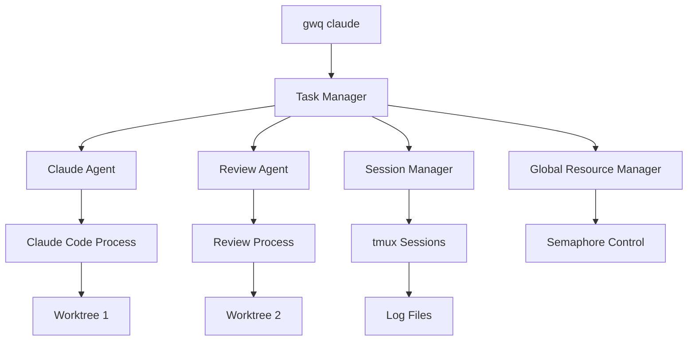
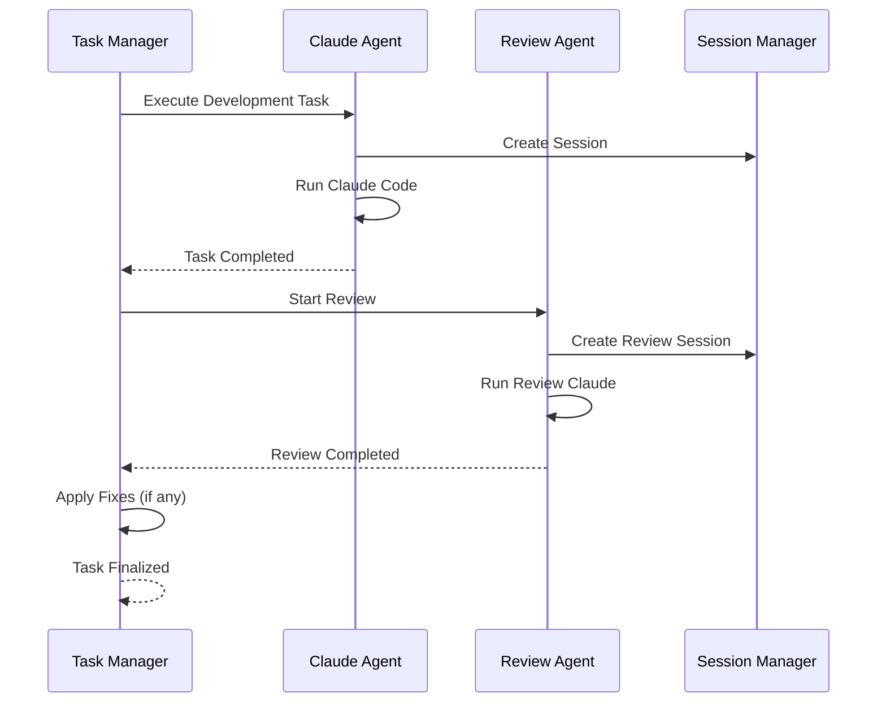

# Claude Task Queue 設計

## 概要

Claude Code前提の自動タスクキューシステムの設計です。開発者が寝ている時間などのアイドルタイムを活用して、自動的にClaude Codeでタスクを実行し、レビューまで完了する機能を提供します。

将来的には他のAIエージェント（Cursor、GitHub Copilot等）にも対応できる拡張可能な設計とします。

## 基本コンセプト

### Claude Code前提の設計

- **専用コマンド**: `gwq claude` サブコマンドで全機能を提供
- **自動レビュー**: タスク完了時に自動的にコードレビューを実行
- **セッション管理**: tmuxを使用したプロセス永続化
- **並列制御**: システム全体でのClaude Code並列数制御

### 将来的な拡張性

```go
// Agent interface for future extensibility
type Agent interface {
    Name() string
    Execute(ctx context.Context, task *Task) (*Result, error)
    HealthCheck() error
    Capabilities() []Capability
}

// Claude Code implementation
type ClaudeAgent struct {
    config *ClaudeConfig
    session *tmux.Session
}

// Future agents
type CursorAgent struct { /* ... */ }
type CopilotAgent struct { /* ... */ }
```

## アーキテクチャ

### 全体構成



### データモデル

```go
type Task struct {
    ID           string            `json:"id"`
    Name         string            `json:"name"`
    Description  string            `json:"description"`
    Branch       string            `json:"branch"`
    Priority     Priority          `json:"priority"`
    Status       Status            `json:"status"`
    CreatedAt    time.Time         `json:"created_at"`
    StartedAt    *time.Time        `json:"started_at,omitempty"`
    CompletedAt  *time.Time        `json:"completed_at,omitempty"`
    WorktreePath string            `json:"worktree_path,omitempty"`
    SessionID    string            `json:"session_id,omitempty"`
    AgentType    string            `json:"agent_type"`
    Result       *TaskResult       `json:"result,omitempty"`
    ReviewResult *ReviewResult     `json:"review_result,omitempty"`
}

type Priority int
const (
    PriorityLow    Priority = 0
    PriorityNormal Priority = 1
    PriorityHigh   Priority = 2
    PriorityUrgent Priority = 3
)

type Status string
const (
    StatusPending     Status = "pending"
    StatusRunning     Status = "running"
    StatusReviewing   Status = "reviewing"
    StatusCompleted   Status = "completed"
    StatusFailed      Status = "failed"
)

type TaskResult struct {
    ExitCode     int              `json:"exit_code"`
    Duration     time.Duration    `json:"duration"`
    FilesChanged []string         `json:"files_changed"`
    CommitHash   string           `json:"commit_hash,omitempty"`
}

type ReviewResult struct {
    Issues       []ReviewIssue    `json:"issues"`
    FixesApplied []string         `json:"fixes_applied"`
    Summary      string           `json:"summary"`
}
```

## コマンド設計

### gwq claude サブコマンド

#### `gwq claude task`

タスク管理機能（既存パターンに準拠）：

```bash
# タスク追加
gwq claude task add -b feature/auth "認証システムの実装"
gwq claude task add -b feature/api "REST APIの実装" -p high
gwq claude task add -f tasks.yaml  # YAML一括登録

# タスク一覧（statusコマンドパターン）
gwq claude task list

# Output:
# TASK          BRANCH        STATUS      PRIORITY   DURATION
# ● auth-impl   feature/auth  running     normal     45m
#   api-dev     feature/api   pending     high       -
#   bug-fix     bugfix/login  completed   urgent     2h 15m

# 詳細情報
gwq claude task list --verbose
gwq claude task list --json
gwq claude task list --csv

# フィルタとソート
gwq claude task list --filter running
gwq claude task list --sort priority --reverse

# リアルタイム監視
gwq claude task list --watch

# 特定タスクの詳細
gwq claude task show auth-impl
gwq claude task show auth  # パターンマッチ
gwq claude task show       # fuzzy finder
```

#### `gwq claude worker`

ワーカー管理：

```bash
# ワーカー開始
gwq claude worker start
gwq claude worker start --parallel 3

# ワーカー状態確認
gwq claude worker status

# Output:
# Worker Status: Running
# Active Tasks: 2/3
# Queue: 5 pending
# Sessions: 2 running, 1 reviewing

# ワーカー停止
gwq claude worker stop

# 設定確認
gwq claude worker config
```

#### `gwq claude session`

セッション管理（tmux統合）：

```bash
# セッション一覧
gwq claude session list

# セッションにアタッチ（パターンマッチ）
gwq claude session attach auth
gwq claude session attach        # fuzzy finder

# ログ表示
gwq claude session logs auth --follow
gwq claude session logs --grep "error"

# セッション終了
gwq claude session kill auth
gwq claude session kill --completed
```

#### `gwq claude review`

レビュー機能：

```bash
# レビュー結果確認
gwq claude review show auth-impl

# Output:
# Review Summary for auth-impl:
# Status: Completed
# Issues Found: 3 (1 error, 2 warnings)
# Fixes Applied: 2
# 
# Issues:
# [ERROR] auth.go:45 - SQL injection vulnerability
# [WARN]  auth.go:78 - Missing error handling
# [INFO]  auth_test.go:23 - Test coverage improvement

# レビュー一覧
gwq claude review list
gwq claude review list --filter error

# 手動レビュー実行
gwq claude review run auth-impl
```

#### `gwq claude start/stop`

直接実行コマンド：

```bash
# 現在のworktreeでClaude起動
gwq claude start
gwq claude start --task "バグを修正してください"

# パターンマッチでworktree指定
gwq claude start -w feature/auth --task "認証システム実装"

# バックグラウンド実行
gwq claude start --background --task "テスト追加"

# 実行中のClaude一覧
gwq claude list

# Output:
# TASK         WORKTREE        STATUS     DURATION   SESSION
# auth-impl    feature/auth    running    45m        attached
# api-dev      feature/api     idle       1h 20m     detached

# Claude停止
gwq claude stop auth
gwq claude stop --all
```

## 自動レビュー機能

### レビューフロー



### レビュー設定

```toml
[claude.review]
# 自動レビューを有効化
enabled = true

# レビュー対象
review_patterns = ["*.go", "*.js", "*.ts", "*.py"]
exclude_patterns = ["*_test.go", "vendor/*"]

# レビュープロンプト
review_prompt = """
以下の点を重点的にレビューしてください：
1. セキュリティの脆弱性
2. バグや潜在的な問題
3. パフォーマンスの懸念
4. コードの可読性
5. テスト不足

修正が必要な場合は自動で修正してください。
"""

# 自動修正
auto_fix = true
max_fix_attempts = 3
```

## 並列制御とリソース管理

### グローバル並列数制御

```go
type ResourceManager struct {
    maxClaude          int
    maxDevelopment     int  
    maxReview         int
    activeDevelopment int
    activeReview      int
    semaphore         *Semaphore
}

func (r *ResourceManager) AcquireSlot(taskType TaskType) (*Slot, error) {
    switch taskType {
    case TaskTypeDevelopment:
        if r.activeDevelopment >= r.maxDevelopment {
            return nil, ErrSlotUnavailable
        }
    case TaskTypeReview:
        if r.activeReview >= r.maxReview {
            return nil, ErrSlotUnavailable
        }
    }
    return r.semaphore.Acquire(), nil
}
```

### 設定

```toml
[claude]
# Claude Code実行ファイル
executable = "claude"
default_args = []

# グローバル並列制御
max_parallel = 5
max_development_tasks = 3
max_review_tasks = 2

# リソース制限
max_cpu_percent = 80
max_memory_mb = 4096
task_timeout = "2h"

[claude.queue]
# キュー管理
max_queue_size = 100
queue_dir = "~/.gwq/claude/queue"

# 優先度処理
priority_boost_after = "1h"
starvation_prevention = true

[claude.session]
# tmuxセッション設定
auto_create_session = true
session_prefix = "gwq-claude"
log_dir = "~/.gwq/claude/logs"
```

## エージェント抽象化設計

### Agent Interface

```go
// 将来的な拡張のためのAgent抽象化
type Agent interface {
    // 基本情報
    Name() string
    Version() string
    Capabilities() []Capability
    
    // タスク実行
    Execute(ctx context.Context, task *Task) (*TaskResult, error)
    Review(ctx context.Context, task *Task) (*ReviewResult, error)
    
    // ヘルスチェック
    HealthCheck() error
    IsAvailable() bool
    
    // セッション管理
    CreateSession(task *Task) (*Session, error)
    AttachSession(sessionID string) error
}

type Capability string

const (
    CapabilityCodeGeneration Capability = "code_generation"
    CapabilityCodeReview     Capability = "code_review"
    CapabilityTesting        Capability = "testing"
    CapabilityRefactoring    Capability = "refactoring"
    CapabilityDocumentation  Capability = "documentation"
)

// Claude Code実装
type ClaudeAgent struct {
    config      *ClaudeConfig
    sessionMgr  *SessionManager
    resourceMgr *ResourceManager
}

func (c *ClaudeAgent) Name() string { return "claude" }
func (c *ClaudeAgent) Capabilities() []Capability {
    return []Capability{
        CapabilityCodeGeneration,
        CapabilityCodeReview,
        CapabilityTesting,
        CapabilityRefactoring,
        CapabilityDocumentation,
    }
}
```

### 将来的な拡張例

```bash
# 将来的に他のエージェントも同様に使用可能
gwq cursor task add -b feature/ui "UI実装"
gwq copilot task add -b feature/api "API実装"

# エージェント固有の機能
gwq claude review run task-123
gwq cursor pair-programming start
gwq copilot suggest improvements

# 統合ビュー
gwq agent list
gwq agent status --all
```

## 統合とワークフロー

### 既存コマンドとの統合

```bash
# worktree作成時にタスクも作成
gwq add -b feature/auth --with-task "認証システム実装"

# statusコマンドでClaude情報も表示
gwq status --verbose

# Output:
# BRANCH          STATUS    CHANGES        ACTIVITY      CLAUDE
# ● main          clean     -             2 hours ago   -
#   feature/auth  changed   5 added, 3 mod running       auth-impl
#   feature/api   clean     -             pending       api-dev (queued)
```

### タスクファイル形式

```yaml
# tasks.yaml
tasks:
  - name: "認証システム実装"
    branch: "feature/auth"
    priority: high
    description: |
      JWT認証システムの完全実装:
      - ログイン/ログアウト機能
      - トークン管理
      - 権限チェック
      - テスト追加
    with_review: true
    
  - name: "API仕様実装"
    branch: "feature/api"  
    priority: normal
    description: |
      OpenAPI仕様に基づくREST API実装:
      - エンドポイント作成
      - バリデーション追加
      - エラーハンドリング
      - ドキュメント更新
    with_review: true
```

## 使用例

### 日常的な開発フロー

```bash
# 朝の作業準備
gwq claude task add -b feature/auth "認証システム実装" 
gwq claude task add -b feature/api "API実装" -p high
gwq claude task add -f evening-tasks.yaml

# ワーカー開始
gwq claude worker start --parallel 2

# 作業状況確認
gwq claude task list --watch

# セッション監視
gwq claude session list

# 夕方、レビュー結果確認
gwq claude review list
gwq claude review show auth --verbose

# 翌朝、完了タスク確認
gwq claude task list --filter completed
gwq status --verbose
```

### エラー対応フロー

```bash
# 失敗タスクの確認
gwq claude task list --filter failed

# ログ確認
gwq claude session logs auth-impl --grep "error"

# 手動で修正後、再実行
gwq claude task retry auth-impl

# セッションを直接確認
gwq claude session attach auth-impl
```

## メリット

1. **時間の有効活用**: 睡眠時間中の自動開発
2. **品質保証**: 自動レビューによる品質向上
3. **効率的な並列処理**: リソースを最大限活用
4. **統合管理**: 一つのコマンド体系で完結
5. **拡張性**: 将来的な他エージェント対応
6. **既存UXとの整合性**: gwqの使い勝手を維持

## 制限事項

1. Claude Code実行環境が必要
2. tmuxがインストールされている必要
3. ネットワーク接続が必要
4. リソース使用量の管理が重要

## まとめ

この設計により、gwqはClaude Code前提の自動開発プラットフォームとして機能し、開発者のアイドルタイムを有効活用できます。将来的な拡張性も考慮し、他のAIエージェントにも対応可能な設計としています。

## 関連ドキュメント

- [DESIGN_TMUX_SESSION.md](./DESIGN_TMUX_SESSION.md) - tmuxセッション管理の詳細