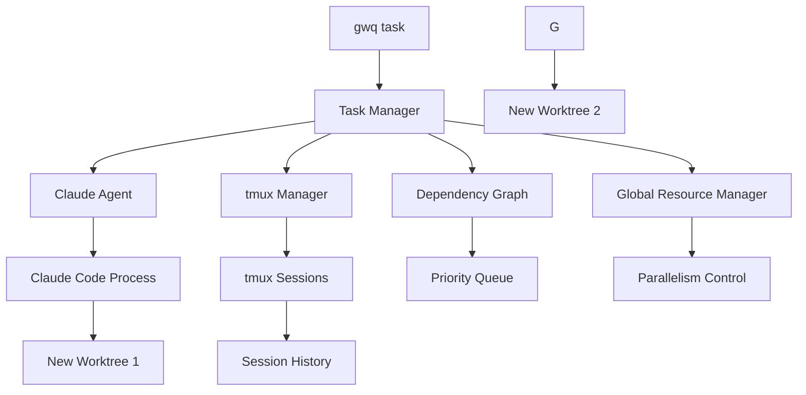
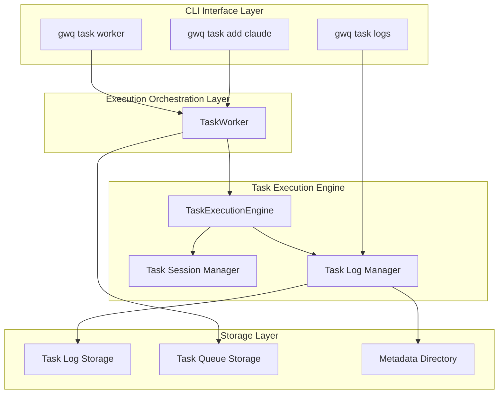

# Task Queue System - Design and Implementation

## 1. High-Level Design

### 1.1 Overview and Purpose

The Task Queue System is an automated development task execution system that leverages Claude Code in dedicated Git worktrees. It enables developers to efficiently utilize idle time (such as during sleep) by automatically executing structured development tasks with built-in dependency management and verification.

**Key Objectives:**
- Automate development tasks during idle periods
- Provide structured task definition with clear objectives and verification
- Manage task dependencies and execution order
- Integrate seamlessly with existing gwq worktree infrastructure

### 1.2 Core Concepts

#### 1.2.1 Task Definition Paradigms

**Two Methods for Task Creation:**
1. **Command Line**: Quick single task creation for immediate needs
2. **YAML Files**: Batch task creation with comprehensive configuration for complex workflows

#### 1.2.2 Flexible Worktree Management

**Key Design Features:**
- **Repository Specification**: YAML files only support absolute paths for clarity and portability
- **Automatic Worktree Creation**: Creates worktrees automatically if they don't exist
- **Required Parameters**: Both `worktree` and `base_branch` are required in YAML files for automatic worktree creation
- **Command Line Flexibility**: Base branch is optional in CLI (defaults to current branch)
- **gwq Integration**: Full integration with existing gwq worktree infrastructure (`~/worktrees/` basedir)

#### 1.2.3 Integration Philosophy

- **Repository Root Execution**: All commands executed from git repository root
- **gwq Worktree Reuse**: Leverages existing gwq worktree management system
- **No Duplicate Infrastructure**: Uses established gwq patterns and configurations
- **Extensible Agent Design**: Prepared for future AI agents (Cursor, GitHub Copilot, etc.)

### 1.3 System Architecture



**Architecture Principles:**
- **Single Responsibility**: Each component has a clear, focused purpose
- **Resource Management**: Global control over Claude Code parallel execution
- **Session Persistence**: tmux-based session management for long-running tasks
- **Dependency Resolution**: Graph-based dependency management with cycle detection

## 2. Basic Usage

### 2.1 Command Line Interface

#### 2.1.0 Task Log Management

The task system provides comprehensive logging and monitoring capabilities:

```bash
# Interactive task log viewing
gwq task logs                           # Fuzzy finder selection of all tasks
gwq task logs auth-impl                 # Show logs for specific task

# Filtering and status monitoring  
gwq task logs --status running          # Show only running tasks
gwq task logs --status completed        # Show only completed tasks
gwq task logs --date 2024-01-15         # Filter by creation date

# Session management
gwq task logs --attach auth-impl        # Attach to running task session
gwq task logs --json                   # JSON output for automation

# Comprehensive task information display
# - Task metadata (ID, status, priority, timing)
# - Context, objectives, and instructions
# - Execution results
# - Real-time session output for running tasks
```

**Key Features:**
- **Task-Specific Logs**: Distinct from `gwq logs` which shows all execution types
- **Interactive Selection**: Fuzzy finder when no task ID specified
- **Status Filtering**: Focus on tasks with specific status
- **Session Integration**: Direct attachment to running task tmux sessions
- **Comprehensive Display**: All task information in formatted output
- **Real-time Monitoring**: Live session output for active tasks

#### 2.1.1 Simple Task Creation

```bash
# Create task (creates worktree from current branch if needed)
gwq task add claude -w feature/auth "Authentication implementation" -p 75

# Create task with specific base branch
gwq task add claude -w feature/api --base develop "API implementation" -p 80

# Task with dependencies
gwq task add claude -b feature/api "REST API implementation" -p 85 --depends-on auth-system
```

**Command Line Defaults:**
- Repository: Current directory (auto-detected)
- Priority: 50 (normal)

#### 2.1.2 Advanced Task Creation

```bash
# Task with comprehensive configuration
gwq task add claude -w feature/api --base main "REST API implementation" \
  -p 80 \
  --depends-on auth-task \
  --prompt "$(cat requirements.md)" \
  --verify "make test" \
  --verify "make lint"
```

#### 2.1.3 Task Management Commands

```bash
# Task monitoring and control
gwq task list                           # Show all tasks
gwq task list --watch                   # Real-time monitoring
gwq task show auth-impl                 # Detailed task information
gwq task list --filter running          # Filter by status

# Task execution logs and monitoring
gwq task logs                           # Interactive task log selection
gwq task logs exec-a1b2c3               # Show logs for specific execution
gwq task logs --status running          # Filter task logs by status
gwq task logs --date 2024-01-15         # Filter by date

# Worker management
gwq task worker start --parallel 2      # Start task execution worker
gwq task worker status                  # Check worker status
gwq task worker stop                    # Stop worker

# Session management (delegates to gwq tmux)
gwq tmux list --context claude          # List Claude sessions
gwq tmux attach claude-auth              # Attach to specific session
```

### 2.2 YAML Configuration

#### 2.2.1 Simplified YAML Structure (Updated Specification)

```yaml
version: "1.0"
repository: /absolute/path/to/repository  # REQUIRED: Absolute path only

# Default configuration for all tasks
default_config:
  skip_permissions: true
  timeout: "2h"
  max_iterations: 3
  dependency_policy: "wait"
  priority: 50

tasks:
  - id: "setup-database"
    name: "Database Schema Setup"
    worktree: "feature/database"       # Worktree name (creates if doesn't exist)
    base_branch: "main"                # Base branch for worktree creation
    priority: 80

  - id: "auth-system-impl"
    name: "Authentication System Implementation"
    worktree: "feature/auth"           # Worktree name (creates if doesn't exist)
    base_branch: "main"                # Base branch for worktree creation
    priority: 75
    depends_on: ["setup-database"]
    dependency_policy: "fail"
```

#### 2.2.2 Advanced YAML Configuration

```yaml
version: "1.0"
repository: /absolute/path/to/repository

default_config:
  timeout: "2h"
  max_iterations: 5

tasks:
  - id: database-migration
    name: "Add user table migration"
    worktree: "feature/user-migration"
    base_branch: "main"
    priority: 90
    prompt: |
      Create a new user table migration for authentication support.
      Follow existing migration patterns in db/migrations/.
      
      Objectives:
      - Create user table migration
      - Add proper indexes
      - Include rollback migration
    verification_commands:
      - "make db-migrate-test"
      - "make db-rollback-test"
    files_to_focus:
      - "db/migrations/"
      - "docs/database.md"

  - id: api-endpoints
    name: "User API endpoints"
    worktree: "feature/user-api"
    base_branch: "main"
    depends_on: [database-migration]
    priority: 85
    config:
      timeout: "3h"
      max_iterations: 8
```

### 2.3 Task Lifecycle

```
1. Task Creation (status: pending)
   ↓
2. Dependency Analysis (status: waiting if dependencies exist)
   ↓
3. Worktree Setup
   - Check if worktree exists
   - Create worktree from base branch if needed
   - Verify worktree is accessible
   ↓
4. Claude Execution (status: running)
   - Execute Claude Code in isolated worktree
   - Monitor progress via tmux session
   ↓
5. Verification
   - Run verification commands
   - Check objectives completion
   ↓
6. Completion (status: completed/failed)
```

## 3. Detailed Design

### 3.1 Data Models

#### 3.1.1 Core Task Structure

```go
type Task struct {
    ID          string     `json:"id"`
    Name        string     `json:"name"`
    Worktree    string     `json:"worktree"`    // Worktree name or path
    BaseBranch  string     `json:"base_branch"` // Base branch for worktree creation
    Priority    Priority   `json:"priority"`    // 1-100, higher = more important
    Status      Status     `json:"status"`
    CreatedAt   time.Time  `json:"created_at"`
    StartedAt   *time.Time `json:"started_at,omitempty"`
    CompletedAt *time.Time `json:"completed_at,omitempty"`

    // Git worktree information (uses existing gwq worktrees)
    RepositoryRoot   string `json:"repository_root"`         // Git repository root path
    WorktreePath     string `json:"worktree_path,omitempty"` // Path to existing gwq worktree

    SessionID string `json:"session_id,omitempty"`
    AgentType string `json:"agent_type"`

    // Task dependencies
    DependsOn        []string         `json:"depends_on"`        // Task IDs this task depends on
    Blocks           []string         `json:"blocks,omitempty"`  // Task IDs blocked by this task (auto-populated)
    DependencyPolicy DependencyPolicy `json:"dependency_policy"` // How to handle dependency failures

    // Enhanced task definition based on Claude Code best practices
    Prompt               string   `json:"prompt"`                // Complete task prompt for Claude
    FilesToFocus         []string `json:"files_to_focus"`        // Key files to work on (relative to worktree)
    VerificationCommands []string `json:"verification_commands"` // Commands to verify success (run in worktree)

    // Task configuration
    Config TaskConfig `json:"config"`

    // Results
    Result *TaskResult `json:"result,omitempty"`

}
```

#### 3.1.2 Priority and Status System

```go
// Numeric priority system (0-100, higher numbers = higher priority)
type Priority int

const (
    PriorityVeryLow  Priority = 10   // Background tasks
    PriorityLow      Priority = 25   // Nice-to-have features
    PriorityNormal   Priority = 50   // Standard development tasks
    PriorityHigh     Priority = 75   // Important features
    PriorityUrgent   Priority = 90   // Critical fixes
    PriorityCritical Priority = 100  // Blocking issues
)

type Status string
const (
    StatusPending     Status = "pending"     // Task is queued
    StatusWaiting     Status = "waiting"     // Waiting for dependencies
    StatusRunning     Status = "running"     // Currently executing
    StatusCompleted   Status = "completed"   // Successfully finished
    StatusFailed      Status = "failed"      // Execution failed
    StatusSkipped     Status = "skipped"     // Skipped due to dependency policy
    StatusCancelled   Status = "cancelled"   // Manually cancelled
)
```

### 3.2 Dependency Management System

#### 3.2.1 Dependency Resolution Algorithm

```go
type DependencyGraph struct {
    tasks map[string]*Task
    edges map[string][]string  // task_id -> dependencies
}

func (dg *DependencyGraph) GetExecutableTask(availableWorkers int) (*Task, error) {
    // Find tasks that are ready to run (no pending dependencies)
    readyTasks := dg.getReadyTasks()
    
    if len(readyTasks) == 0 {
        return nil, ErrNoExecutableTasks
    }
    
    // Sort by priority (highest first), then by creation time (oldest first)
    sort.Slice(readyTasks, func(i, j int) bool {
        if readyTasks[i].Priority == readyTasks[j].Priority {
            return readyTasks[i].CreatedAt.Before(readyTasks[j].CreatedAt)
        }
        return readyTasks[i].Priority > readyTasks[j].Priority
    })
    
    return readyTasks[0], nil
}

func (dg *DependencyGraph) areDependenciesCompleted(task *Task) bool {
    for _, depID := range task.DependsOn {
        depTask, exists := dg.tasks[depID]
        if !exists {
            return false
        }
        
        switch depTask.Status {
        case StatusCompleted:
            continue // OK
        case StatusFailed:
            // Handle based on dependency policy
            switch task.DependencyPolicy {
            case DependencyPolicyFail:
                task.Status = StatusFailed
                return false
            case DependencyPolicySkip:
                task.Status = StatusSkipped
                return false
            case DependencyPolicyWait:
                return false // Keep waiting
            }
        default:
            return false // Still pending/running
        }
    }
    
    return true
}
```

#### 3.2.2 Dependency Policies

```go
type DependencyPolicy string

const (
    DependencyPolicyWait DependencyPolicy = "wait"  // Wait for dependencies to complete (default)
    DependencyPolicySkip DependencyPolicy = "skip"  // Skip this task if dependency fails
    DependencyPolicyFail DependencyPolicy = "fail"  // Fail this task if dependency fails
)
```

### 3.3 Agent Abstraction

#### 3.3.1 Agent Interface for Extensibility

```go
// Agent abstraction for future extensions
type Agent interface {
    // Basic information
    Name() string
    Version() string
    Capabilities() []Capability
    
    // Task execution
    Execute(ctx context.Context, task *Task) (*TaskResult, error)
    
    // Health check
    HealthCheck() error
    IsAvailable() bool
    
    // Session management
    CreateSession(task *Task) (*Session, error)
    AttachSession(sessionID string) error
}

type Capability string

const (
    CapabilityCodeGeneration Capability = "code_generation"
    CapabilityTesting        Capability = "testing"
    CapabilityRefactoring    Capability = "refactoring"
    CapabilityDocumentation  Capability = "documentation"
)
```

## 4. Implementation Specifications

### 4.1 Claude Code Integration

#### 4.1.1 Claude Agent Implementation

```go
type ClaudeAgent struct {
    config      *ClaudeConfig
    sessionMgr  *SessionManager
    resourceMgr *ResourceManager
}

func (c *ClaudeAgent) Execute(ctx context.Context, task *Task) (*TaskResult, error) {
    // Always create new worktree using gwq worktree management
    if err := c.createNewWorktree(task); err != nil {
        return nil, fmt.Errorf("failed to prepare worktree: %w", err)
    }
    
    // Build Claude Code command with automation flags and log capture
    cmd := c.buildCommandWithLogging(task)
    
    // Create tmux session for persistent execution in worktree
    session, err := c.sessionMgr.CreateSession(ctx, SessionOptions{
        Context:    "claude",
        Identifier: fmt.Sprintf("%s-%s", task.Worktree, task.ID),
        WorkingDir: task.WorktreePath,  // Execute Claude inside worktree
        Command:    cmd,
        Metadata: map[string]string{
            "task_id":      task.ID,
            "task_name":    task.Name,
            "worktree":     task.Worktree,
            "base_branch":  task.BaseBranch,
            "worktree_path": task.WorktreePath,
            "repo_root":    task.RepositoryRoot,
        },
    })
    if err != nil {
        return nil, fmt.Errorf("failed to create session: %w", err)
    }
    
    // Monitor execution and handle results
    result, err := c.monitorExecution(ctx, session, task)
    if err != nil {
        return nil, err
    }
    
    return result, nil
}

func (c *ClaudeAgent) createNewWorktree(task *Task) error {
    // Always create new worktree using gwq worktree management
    cmd := exec.Command("gwq", "add", "-b", task.Worktree, "--base", task.BaseBranch)
    cmd.Dir = task.RepositoryRoot
    
    if err := cmd.Run(); err != nil {
        return fmt.Errorf("failed to create worktree via gwq add: %w", err)
    }
    
    // Find the newly created worktree path using gwq's path generation
    worktreePath, err := c.findGwqWorktree(task.Worktree)
    if err != nil {
        return fmt.Errorf("worktree created but not found: %w", err)
    }
    task.WorktreePath = worktreePath
    return nil
}

func (c *ClaudeAgent) findGwqWorktree(worktreeName string) (string, error) {
    // Use gwq's existing worktree discovery logic
    // This integrates with gwq's worktree management using basedir configuration
    // Returns the path to the worktree: ~/worktrees/github.com/user/repo/worktree-name
    return gwq.FindWorktreeByName(worktreeName)
}
```

#### 4.1.2 Claude Command Construction with Logging

```go
func (c *ClaudeAgent) buildCommandWithLogging(task *Task) string {
    // Generate task prompt
    prompt := c.buildTaskPrompt(task)
    
    // Escape prompt for shell
    escapedPrompt := escapeForShell(prompt)
    
    // Generate log file paths
    timestamp := time.Now().Format("20060102-150405")
    logDir := filepath.Join(c.config.ConfigDir, "logs", "executions")
    metadataDir := filepath.Join(c.config.ConfigDir, "logs", "metadata")
    
    logFile := filepath.Join(logDir, fmt.Sprintf("%s-task-%s.jsonl", timestamp, task.ID))
    metadataFile := filepath.Join(metadataDir, fmt.Sprintf("%s-task-%s.json", timestamp, task.ID))
    
    // Create directories if they don't exist
    os.MkdirAll(logDir, 0755)
    os.MkdirAll(metadataDir, 0755)
    
    // Create metadata file at execution start
    c.createMetadataFile(task, metadataFile, timestamp)
    
    // Build command with log capture using tee
    return fmt.Sprintf(`claude --verbose --dangerously-skip-permissions --output-format stream-json -p "%s" | tee "%s"`, 
        escapedPrompt, logFile)
}

func (c *ClaudeAgent) createMetadataFile(task *Task, metadataFile string, timestamp string) error {
    metadata := map[string]interface{}{
        "execution_id":     fmt.Sprintf("task-%s", task.ID),
        "session_id":       task.SessionID,
        "execution_type":   "task",
        "start_time":       time.Now().Format(time.RFC3339),
        "status":           "running",
        "repository":       task.RepositoryRoot,
        "working_directory": task.WorktreePath,
        "tmux_session":     fmt.Sprintf("gwq-claude-task-%s-%s", task.ID, timestamp),
        "task_info": map[string]interface{}{
            "task_id":       task.ID,
            "task_name":     task.Name,
            "branch":        task.Worktree,
            "base_branch":   task.BaseBranch,
            "worktree_path": task.WorktreePath,
            "dependencies":  task.DependsOn,
            "task_priority": task.Priority,
            "objectives":    task.Objectives,
        },
        "tags":     []string{"task", "automation"},
        "priority": fmt.Sprintf("%d", task.Priority),
    }
    
    metadataJSON, _ := json.MarshalIndent(metadata, "", "  ")
    return os.WriteFile(metadataFile, metadataJSON, 0644)
}
```

**Command Output Example:**
```bash
claude --verbose --dangerously-skip-permissions --output-format stream-json -p "# Task: Authentication Implementation

## Objectives
- Implement user login system
- Add JWT token support

## Success Criteria
Task is complete when:
- All objectives are met
- All verification commands pass
- Code follows project conventions
- No security issues introduced
" | tee "/home/user/.config/gwq/claude/logs/executions/20240612-150405-task-auth-impl.jsonl"
```

**Tmux Session Creation:**
```bash
tmux new-session -d -s "gwq-claude-task-auth-impl-20240612150405" "claude --verbose ... | tee logfile.jsonl"
```

**Generated Files:**
- **Execution Log**: `~/.config/gwq/claude/logs/executions/20240612-150405-task-auth-impl.jsonl`
  - Contains real-time JSON stream output from Claude Code
  - Used for detailed execution analysis and debugging
- **Metadata File**: `~/.config/gwq/claude/logs/metadata/20240612-150405-task-auth-impl.json`
  - Contains task execution metadata and status
  - Used for task tracking and log discovery

**Automatic Session Cleanup:**
- Uses tmux's standard behavior: `tmux new-session -d -s "session-name" "command"`
- When the specified command completes (succeeds or fails), the tmux session automatically terminates
- This leverages tmux's built-in session lifecycle management instead of manual cleanup
- Ensures sessions never remain indefinitely after task completion
- More reliable than manual session termination as it's handled by tmux itself

#### 4.1.3 Task Prompt Generation

```go
func (c *ClaudeAgent) buildTaskPrompt(task *Task) string {
    var prompt strings.Builder
    
    prompt.WriteString(fmt.Sprintf("# Task: %s\n\n", task.Name))
    
    if task.Prompt != "" {
        prompt.WriteString(fmt.Sprintf("%s\n\n", task.Prompt))
    }
    
    if len(task.FilesToFocus) > 0 {
        prompt.WriteString("## Files to Focus On\n")
        for _, file := range task.FilesToFocus {
            prompt.WriteString(fmt.Sprintf("- %s\n", file))
        }
        prompt.WriteString("\n")
    }
    
    if len(task.VerificationCommands) > 0 {
        prompt.WriteString("## Verification Commands\n")
        prompt.WriteString("Please run these commands to verify your work:\n")
        for _, cmd := range task.VerificationCommands {
            prompt.WriteString(fmt.Sprintf("- `%s`\n", cmd))
        }
        prompt.WriteString("\n")
    }
    
    prompt.WriteString("## Success Criteria\n")
    prompt.WriteString("Task is complete when:\n")
    prompt.WriteString("- All verification commands pass\n")
    prompt.WriteString("- Code follows project conventions\n")
    prompt.WriteString("- No security issues introduced\n")
    
    return prompt.String()
}
```

### 4.2 Resource Management

#### 4.2.1 Global Parallelism Control

```go
type ResourceManager struct {
    maxClaude          int
    maxDevelopment     int  
    maxReview         int
    activeDevelopment int
    activeReview      int
    semaphore         *Semaphore
}

func (r *ResourceManager) AcquireSlot(taskType TaskType) (*Slot, error) {
    switch taskType {
    case TaskTypeDevelopment:
        if r.activeDevelopment >= r.maxDevelopment {
            return nil, ErrSlotUnavailable
        }
    case TaskTypeReview:
        if r.activeReview >= r.maxReview {
            return nil, ErrSlotUnavailable
        }
    }
    return r.semaphore.Acquire(), nil
}
```


## 5. Configuration

### 5.1 Claude Configuration

```toml
[claude]
# Claude Code executable and core options
executable = "claude"
skip_permissions = true                # ALWAYS true for automation
timeout = "2h"                         # Default timeout
max_iterations = 3                     # Default max iterations
config_dir = "~/.config/gwq/claude"    # Configuration and state files (XDG compliant)

# Additional arguments passed to Claude Code
additional_args = [
    "--json-output",                   # For structured result parsing (optional)
]

# Global parallelism control
max_parallel = 3
max_development_tasks = 2

# Resource limits
max_cpu_percent = 80
max_memory_mb = 4096

[claude.worktree]
# Integration with gwq worktree management
auto_create_worktree = true            # Always create new worktrees
validate_base_branch_exists = true     # Check base branch exists before task creation

[claude.queue]
# Task queue management
max_queue_size = 50
queue_dir = "~/.config/gwq/claude/queue"

# Priority processing
priority_boost_after = "1h"           # Boost priority of waiting tasks
starvation_prevention = true           # Prevent low priority tasks from starving

# Dependency processing
dependency_timeout = "30m"             # Max time to wait for dependencies
max_dependency_depth = 5               # Max depth of dependency chains
validate_dependencies = true           # Validate dependency graph on task creation

# Task validation
validate_task_files = true
required_fields = ["objectives", "instructions", "verification_commands"]

[claude.logging]
# Execution logging configuration
log_retention_days = 30               # Automatically remove logs older than 30 days
max_log_size_mb = 100                # Maximum size per log file
auto_cleanup = true                  # Enable automatic cleanup
log_format = "jsonl"                 # Log format (jsonl for streaming JSON)
capture_method = "tee"               # Use tee command for real-time log capture

# Log directory structure
execution_logs_dir = "logs/executions"  # Relative to config_dir
metadata_dir = "logs/metadata"          # Relative to config_dir

```

### 5.2 Directory Structure

```
~/.config/gwq/claude/
├── queue/                    # Task queue files
├── history/                  # tmux history backups (optional)
├── logs/                     # Application logs
└── cache/                    # Temporary cache files

# Per-repository (uses existing gwq worktree structure with basedir)
~/worktrees/github.com/user/repo/
├── feature-auth/             # New Claude task worktree
├── feature-api/              # New Claude task worktree
└── ...
```

## 6. Usage Examples and Best Practices

### 6.1 Daily Development Workflow

```bash
# Execute ALL commands from repository root
cd /path/to/your/project

# Morning work preparation - load structured tasks
gwq task add -f daily-tasks.yaml
  # → Creates new worktrees via gwq worktree management

# Or add individual tasks with prompt
gwq task add claude -b feature/auth "Authentication System" \
  --prompt "$(cat docs/auth-requirements.md)" \
  --verify "make test" \
  --verify "make security-check" \
  --depends-on setup-database \
  -p 75
  # → Creates new worktree feature/auth from main branch
  
# Start worker with dependency resolution (from repository root)
gwq task worker start --parallel 2
  # → Worker manages worktrees, resolves dependencies, and executes Claude in each

# Check work status (shows worktree paths and dependencies)
gwq task list --watch

# Monitor sessions (shows worktree info)
gwq tmux list --context claude

# Check task logs and progress
gwq task logs                           # Interactive log selection
gwq task logs auth-impl                 # Show specific task logs
gwq task logs --status running          # Show only running tasks
gwq task logs --attach auth-impl        # Attach to running task session

# Evening, check task results
gwq task show auth

# Next morning, check completed tasks
gwq task list --filter completed

# View execution logs and metadata
ls ~/.config/gwq/claude/logs/executions/       # See all execution logs
ls ~/.config/gwq/claude/logs/metadata/         # See all metadata files

# Cleanup completed task worktrees manually when needed
# → Use standard gwq commands to remove worktrees: gwq remove
```

### 6.2 Task Dependencies Example

```yaml
tasks:
  # Foundation tasks (no dependencies)
  - id: database-setup
    name: "Database schema"
    worktree: "feature/db-schema"
    base_branch: "main"
    priority: 100

  # Dependent tasks
  - id: user-auth
    name: "User authentication"
    worktree: "feature/auth"
    base_branch: "main"
    depends_on: [database-setup]
    priority: 90

  - id: user-profile
    name: "User profile management"
    worktree: "feature/profile"
    base_branch: "main"
    depends_on: [user-auth]
    priority: 80

  # Integration task (depends on multiple)
  - id: frontend-integration
    name: "Frontend integration"
    worktree: "feature/frontend"
    base_branch: "main"
    depends_on: [user-auth, user-profile]
    priority: 70
```

### 6.3 Task Naming Conventions

- **ID**: kebab-case, descriptive (`user-auth`, `api-endpoints`)
- **Name**: Human readable (`"Implement user authentication"`)
- **Worktree**: feature/scope format (`feature/auth`, `bugfix/login-error`)

## 7. Error Handling and Limitations

### 7.1 Common Validation Errors

| Error | Cause | Solution |
|-------|-------|----------|
| "worktree must be specified" | No worktree specified | Add `-w worktree-name` |
| "base_branch is required" | No base branch in YAML | Add `base_branch: main` to task |
| "priority must be between 1 and 100" | Invalid priority value | Set priority between 1-100 |
| "circular dependency detected" | Dependency loop | Review dependency graph |
| "repository path not absolute" | Relative path in YAML | Use absolute path like `/home/user/project` |

### 7.2 Dependency Error Handling

```yaml
# Handle dependency failures
tasks:
  - id: optional-task
    name: "Optional enhancement"
    depends_on: [risky-task]
    dependency_policy: skip  # Skip if dependency fails

  - id: critical-task
    name: "Critical feature"
    depends_on: [foundation-task]
    dependency_policy: fail  # Fail if dependency fails (default: wait)
```

### 7.3 System Limitations

1. Requires Claude Code execution environment
2. Requires tmux installation
3. Requires git repository with worktree support
4. Requires execution from repository root
5. Requires network connection
6. Important to manage resource usage and worktree disk space
7. Deep dependency chains (>5 levels) may impact performance

## 8. Key Workflow

1. **Repository Root**: Execute all `gwq task` commands from git repository root
2. **Worktree Setup**: Create worktree from base branch if it doesn't exist
3. **Base Branch Validation**: Verify base branch exists before worktree creation
4. **Dependency Analysis**: Validate dependency graph and detect circular dependencies
5. **Dependency Resolution**: Wait for required tasks before execution
6. **Task Execution**: Claude Code runs inside newly created gwq worktree
7. **Verification**: Commands executed within worktree context
8. **Session Management**: tmux sessions track worktree-based execution
9. **Dependency Updates**: Real-time dependency status monitoring

## 9. Benefits and Future Extensibility

### 9.1 Current Benefits

1. **Simplified Infrastructure**: Leverages gwq's worktree management system
2. **Clear Specifications**: Simplified YAML with absolute paths and required parameters
3. **Flexible Worktree Management**: Creates worktrees automatically when needed, reuses existing ones
4. **Effective Time Utilization**: Automated development during idle periods
5. **Quality Assurance**: Built-in reviews and verification
6. **Dependency Management**: Essential dependency resolution without complexity

### 9.2 Future Extensions

```bash
# Future support for other agents with dependencies
gwq task add cursor -w feature/ui --base main "UI implementation" --depends-on api-endpoints -p 60
gwq task add copilot -w feature/api --base develop "API implementation" --depends-on auth-system -p 70

# Agent-specific worker management
gwq task worker start --agent cursor
gwq task worker start --agent copilot --priority 85
```

This design enables gwq to function as a comprehensive git worktree-based Claude Code automated development platform with simplified configuration, predictable behavior, and effective dependency management, maximizing developer productivity during idle periods.

## 10. System Architecture and Logging

### 10.1 System Overview

The gwq Claude system provides a structured task queue for automated development tasks with dependency management and comprehensive logging.

### 10.2 Architecture Design Principles

- **Task Execution Engine**: Dedicated execution engine for task processing
- **Consistent Logging**: JSON log format for all task executions
- **Session Management**: tmux-based session handling for tasks
- **Task Monitoring**: Comprehensive interface for task activities
- **Extensible Design**: Foundation for future AI agents (Cursor, GitHub Copilot, etc.)

#### 10.2.1 System Architecture



### 10.3 Data Models

#### 10.3.1 Task Execution Record

```go
type TaskExecution struct {
    // Core identification
    ExecutionID   string            `json:"execution_id"`   // Unique task execution ID
    SessionID     string            `json:"session_id"`     // tmux session identifier
    ExecutionType ExecutionType     `json:"execution_type"` // "task", "review"
    
    // Timing and status
    StartTime     time.Time         `json:"start_time"`
    EndTime       *time.Time        `json:"end_time,omitempty"`
    Status        ExecutionStatus   `json:"status"`
    
    // Execution context
    Repository    string            `json:"repository"`
    WorkingDir    string            `json:"working_directory"`
    TmuxSession   string            `json:"tmux_session"`
    
    // Content and results
    Prompt        string            `json:"prompt"`         // Generated task prompt
    Result        *ExecutionResult  `json:"result,omitempty"`
    
    // Task-specific information (when ExecutionType == "task")
    TaskInfo      *TaskExecutionInfo `json:"task_info,omitempty"`
    
    // Metadata
    Tags          []string          `json:"tags,omitempty"`
    Priority      string            `json:"priority"`
    Model         string            `json:"model,omitempty"`
    CostUSD       float64           `json:"cost_usd"`
    DurationMS    int64             `json:"duration_ms"`
}

type ExecutionType string
const (
    ExecutionTypeTask     ExecutionType = "task"
    ExecutionTypeReview   ExecutionType = "review"
)

type TaskExecutionInfo struct {
    TaskID        string   `json:"task_id"`
    TaskName      string   `json:"task_name"`
    Worktree      string   `json:"worktree,omitempty"`
    WorktreePath  string   `json:"worktree_path,omitempty"`
    Dependencies  []string `json:"dependencies,omitempty"`
    TaskPriority  int      `json:"task_priority"`
    Prompt        string   `json:"prompt,omitempty"`
}

type ExecutionResult struct {
    Success       bool     `json:"success"`
    ExitCode      int      `json:"exit_code"`
    Error         string   `json:"error,omitempty"`
    FilesChanged  []string `json:"files_changed,omitempty"`
    
    // Detailed analysis
    TokensUsed    int      `json:"tokens_used,omitempty"`
    ToolsUsed     []string `json:"tools_used,omitempty"`
    Summary       string   `json:"summary,omitempty"`
}
```

#### 10.3.2 Log Storage Structure

```
~/.config/gwq/claude/
├── logs/
│   ├── executions/           # Task execution logs (flat structure, timestamp-first)
│   │   ├── 20240612-150405-task-auth-impl.jsonl           # Task execution JSON stream
│   │   ├── 20240612-151200-review-auth-impl.jsonl         # Review execution JSON stream
│   │   └── ...
│   └── metadata/             # Task metadata (single source of truth)
│       ├── 20240612-150405-task-auth-impl.json            # Task metadata
│       └── 20240612-151200-review-auth-impl.json          # Review metadata
├── queue/                    # Task queue storage
└── cache/                    # Temporary files
```

#### 10.3.3 JSON Log Format (JSONL)

Each execution produces a stream of JSON objects (one per line) captured via `tee`:

```json
{"type":"system","subtype":"init","cwd":"/path/to/worktree","session_id":"uuid","tools":["Task","Bash","..."],"model":"claude-sonnet-4","timestamp":"2024-06-12T15:04:05Z"}
{"type":"assistant","message":{"id":"msg_123","content":[{"type":"text","text":"I'll help you implement the authentication system."}]},"timestamp":"2024-06-12T15:04:06Z"}
{"type":"assistant","message":{"content":[{"type":"tool_use","id":"tool_456","name":"Read","input":{"file_path":"/path/to/worktree/auth/models.go"}}]},"timestamp":"2024-06-12T15:04:07Z"}
{"type":"user","message":{"content":[{"tool_use_id":"tool_456","type":"tool_result","content":"package auth\n\ntype User struct {\n    ID int\n}","is_error":false}]},"timestamp":"2024-06-12T15:04:08Z"}
{"type":"assistant","message":{"content":[{"type":"text","text":"I can see the existing User model. Now I'll implement the authentication system."}]},"timestamp":"2024-06-12T15:04:09Z"}
{"type":"result","subtype":"success","cost_usd":0.08432156,"duration_ms":12450,"result":"Authentication system implemented","session_id":"uuid","timestamp":"2024-06-12T15:04:10Z"}
```

**Log File Structure:**
- **Real-time capture**: Output captured via `tee` as Claude Code executes
- **JSONL format**: One JSON object per line for easy streaming and parsing
- **Complete conversation**: Includes all tool uses, responses, and system messages
- **Timestamped entries**: Each log entry includes precise timestamp
- **Error handling**: Errors and failures are also captured in the stream

**Improved Design Principles:**
- **No Index Files**: Metadata directory is scanned directly for robustness
- **Timestamp-First Naming**: Files sorted chronologically by default (YYYYMMDD-HHMMSS format)
- **Flat Structure**: No date subdirectories for simplicity and performance
- **Type Prefixes**: Log files include execution type for better organization
- **Complete Metadata**: Each file contains all necessary execution information
- **Fault Tolerance**: Missing log files don't break the system
- **Real-time Accuracy**: No synchronization lag between storage and display
- **Auto Cleanup**: Automatic removal of old files based on retention policy

#### 10.3.4 Metadata File Example

```json
{
  "execution_id": "task-auth-impl",
  "session_id": "ab123456-cd78-90ef-gh12-ijklmnopqrst",
  "execution_type": "task",
  "start_time": "2024-06-12T15:04:05Z",
  "status": "running",
  "repository": "/Users/user/project",
  "working_directory": "/Users/user/project/.worktrees/feature-auth",
  "tmux_session": "gwq-claude-task-auth-impl-20240612150405",
  "task_info": {
    "task_id": "auth-impl",
    "task_name": "Authentication Implementation",
    "worktree": "feature/auth",
    "base_branch": "main",
    "worktree_path": "/Users/user/project/.worktrees/feature-auth",
    "dependencies": ["setup-database"],
    "task_priority": 80,
    "prompt": "Implement user authentication system with JWT support..."
  },
  "tags": ["task", "automation"],
  "priority": "80"
}
```

**Metadata File Usage:**
- **Task Discovery**: Scan metadata directory to find all executions
- **Status Tracking**: Monitor task progress without parsing large log files
- **Session Management**: Connect to running tmux sessions
- **Dependency Resolution**: Track task relationships and completion status

### 10.4 CLI Interface

#### 10.4.1 Command Structure

```bash
# Task management commands
gwq task add claude "task description"     # Add structured task
gwq task list                      # List all tasks
gwq task show task-id              # Show task details

# Task log management
gwq task logs                      # Interactive task log selection
gwq task logs task-id              # Show logs for specific task
gwq task logs --status running     # Filter task logs by status
gwq task logs --attach task-id     # Attach to running task session

# Worker and status control
gwq task worker start                   # Start task worker
gwq task worker status                  # Check worker status
gwq task worker stop                    # Stop worker
```

#### 10.4.2 Task Log Viewer Interface

```bash
gwq task logs
# Output:
┌─ Select Task ───────────────────────────────────────────────────────────────┐
│ ● [TASK]     │ 14:45 │ Authentication system implementation   │ 5m ago     │
│ ✓ [TASK]     │ 13:15 │ Database migration scripts            │ 1h ago     │
│ ✗ [TASK]     │ 12:45 │ Performance optimization task         │ 2h ago     │
│ ● [TASK]     │ 14:51 │ API endpoint implementation           │ just now   │
└─────────────────────────────────────────────────────────────────────────────┘
```

### 10.5 Task ExecutionEngine Implementation

#### 10.5.1 Core Engine Design

```go
type TaskExecutionEngine struct {
    sessionManager  *TaskSessionManager
    logManager      *TaskLogManager
    claudeExecutor  *ClaudeCodeExecutor
    config          *models.ClaudeConfig
}

func (tee *TaskExecutionEngine) Execute(ctx context.Context, req *TaskExecutionRequest) (*TaskExecution, error) {
    // 1. Create task execution record
    execution := &TaskExecution{
        ExecutionID:   generateExecutionID(req.Type),
        SessionID:     generateSessionID(),
        ExecutionType: req.Type,
        StartTime:     time.Now(),
        Status:        ExecutionStatusRunning,
        Repository:    req.Repository,
        WorkingDir:    req.WorkingDir,
        Prompt:        req.Prompt,
        TaskInfo:      req.TaskInfo,
        Tags:          req.Tags,
        Priority:      req.Priority,
    }
    
    // 2. Create tmux session for task
    session, err := tee.sessionManager.CreateSession(ctx, execution)
    if err != nil {
        return nil, err
    }
    execution.TmuxSession = session.SessionName
    
    // 3. Start task logging
    logFile, err := tee.logManager.StartLogging(execution)
    if err != nil {
        return nil, err
    }
    
    // 4. Execute Claude Code for task
    result, err := tee.claudeExecutor.Execute(ctx, execution, logFile)
    
    // 5. Update execution record
    execution.Result = result
    execution.EndTime = &time.Now()
    if err != nil {
        execution.Status = ExecutionStatusFailed
        execution.Result.Error = err.Error()
    } else {
        execution.Status = ExecutionStatusCompleted
    }
    
    // 6. Save to task storage
    if err := tee.logManager.SaveExecution(execution); err != nil {
        return nil, err
    }
    
    return execution, nil
}

type TaskExecutionRequest struct {
    Type        ExecutionType
    Prompt      string
    Repository  string
    WorkingDir  string
    TaskInfo    *TaskExecutionInfo
    Tags        []string
    Priority    string
    Timeout     time.Duration
}
```

#### 10.5.2 Task Session Management

```go
type TaskSessionManager struct {
    tmuxCmd     *TmuxCommand
    config      *SessionConfig
}

func (tsm *TaskSessionManager) CreateSession(ctx context.Context, execution *TaskExecution) (*Session, error) {
    // Task session naming: gwq-claude-{type}-{id}-{timestamp}
    sessionName := fmt.Sprintf("gwq-claude-%s-%s-%s", 
        execution.ExecutionType,
        execution.ExecutionID, 
        time.Now().Format("20060102150405"))
    
    // Build Claude command with logging
    command := tsm.buildClaudeCommand(execution)
    
    // Create session with command - session will auto-terminate when command completes
    if command != "" {
        // Direct command execution - tmux handles session lifecycle
        if err := tsm.tmuxCmd.NewSessionWithCommandContext(ctx, sessionName, execution.WorkingDir, command); err != nil {
            return nil, fmt.Errorf("failed to create tmux session with command: %w", err)
        }
    } else {
        // Traditional session creation (fallback)
        if err := tsm.tmuxCmd.NewSessionContext(ctx, sessionName, execution.WorkingDir); err != nil {
            return nil, fmt.Errorf("failed to create tmux session: %w", err)
        }
    }
    
    // Set session options
    if err := tsm.tmuxCmd.SetOptionContext(ctx, sessionName, "history-limit", tsm.config.HistoryLimit); err != nil {
        _ = tsm.tmuxCmd.KillSession(sessionName)
        return nil, fmt.Errorf("failed to set history limit: %w", err)
    }
    
    return &Session{
        SessionName: sessionName,
        Context:     fmt.Sprintf("claude-%s", execution.ExecutionType),
        Identifier:  execution.ExecutionID,
        WorkingDir:  execution.WorkingDir,
        Command:     command,
    }, nil
}
```

### 10.6 Implementation Strategy

#### 10.6.1 Implementation Phases

**Phase 1: Core Task System**
- Implement TaskExecutionEngine
- Build TaskWorker with dependency management
- Create task log storage format
- Implement basic CLI interfaces

**Phase 2: Enhanced Features**  
- Add `gwq task logs` command
- Implement task filtering capabilities
- Add comprehensive status reporting
- Build cleanup operations

**Phase 3: Advanced Features**
- Enhanced dependency management
- Cost tracking and reporting for tasks
- Performance analytics
- Multi-agent preparation (foundation for Cursor, Copilot, etc.)

**Phase 4: Optimization**
- Task execution optimization
- Intelligent worktree reuse
- Advanced monitoring and alerting
- Resource optimization

#### 10.6.2 Implementation Priority

```go
// High Priority (Core Task System)
type CoreTaskSystem struct {
    TaskExecutionEngine  // Task execution backend
    TaskLogStorage       // Task log format and storage
    SessionManagement    // tmux session management for tasks
}

// Medium Priority (Enhanced UX)
type EnhancedUX struct {
    TaskLogViewer        // Interface for task logs
    TaskFiltering        // Filter logs by status, date
    StatusCommand        // Task status command
}

// Lower Priority (Advanced Features)
type AdvancedFeatures struct {
    AdvancedDependencies // Complex dependency patterns
    TaskAnalytics        // Cost, performance, success rate analysis
    MultiAgentPrep       // Foundation for multiple AI agents
}
```

### 10.7 System Benefits

#### 10.7.1 Developer Experience

- **Task Automation**: Automated development tasks with dependency management
- **Consistent Interface**: Clear task-focused commands and patterns
- **Structured Workflow**: Organized task execution with priorities
- **Comprehensive History**: Complete audit trail of all task executions

#### 10.7.2 Operational Benefits

- **Task Monitoring**: Comprehensive dashboard for task operations
- **Structured Logging**: Consistent log format for all tasks
- **Resource Management**: Efficient worktree and session management
- **Cost Tracking**: Detailed cost analysis for task executions

#### 10.7.3 Technical Benefits

- **Focused Design**: Dedicated task execution engine
- **Better Testability**: Clear testing framework for task system
- **Enhanced Reliability**: Robust error handling for long-running tasks
- **Future-Proof**: Foundation for additional AI agents and capabilities

### 10.8 Future Extensibility

#### 10.8.1 Multi-Agent Architecture

The task system provides foundation for multiple AI agents:

```go
type AgentType string
const (
    AgentClaude  AgentType = "claude"
    AgentCursor  AgentType = "cursor"
    AgentCopilot AgentType = "copilot"
)

type MultiAgentTask struct {
    Agent       AgentType
    Task        *TaskExecution
    AgentConfig interface{}  // Agent-specific configuration
}

// Future commands
// gwq task add cursor "description"
// gwq task add copilot "description"
// gwq task logs --agent claude
// gwq status --all-agents
```

#### 10.8.2 Advanced Orchestration

- **Agent Collaboration**: Multiple agents working on related tasks
- **Agent Selection**: Automatic agent selection based on task requirements
- **Cross-Agent Dependencies**: Tasks that span multiple AI agents
- **Unified Resource Management**: Managing resources across all agents

This architecture enables gwq to function as a comprehensive git worktree-based AI task automation platform, focused on structured task execution with dependency management and comprehensive monitoring.

## 11. Related Documentation

- [DESIGN_TMUX_SESSION.md](./DESIGN_TMUX_SESSION.md) - Generic tmux session management foundation