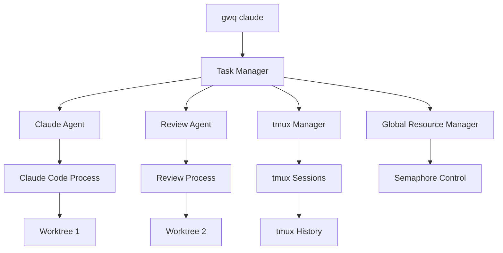
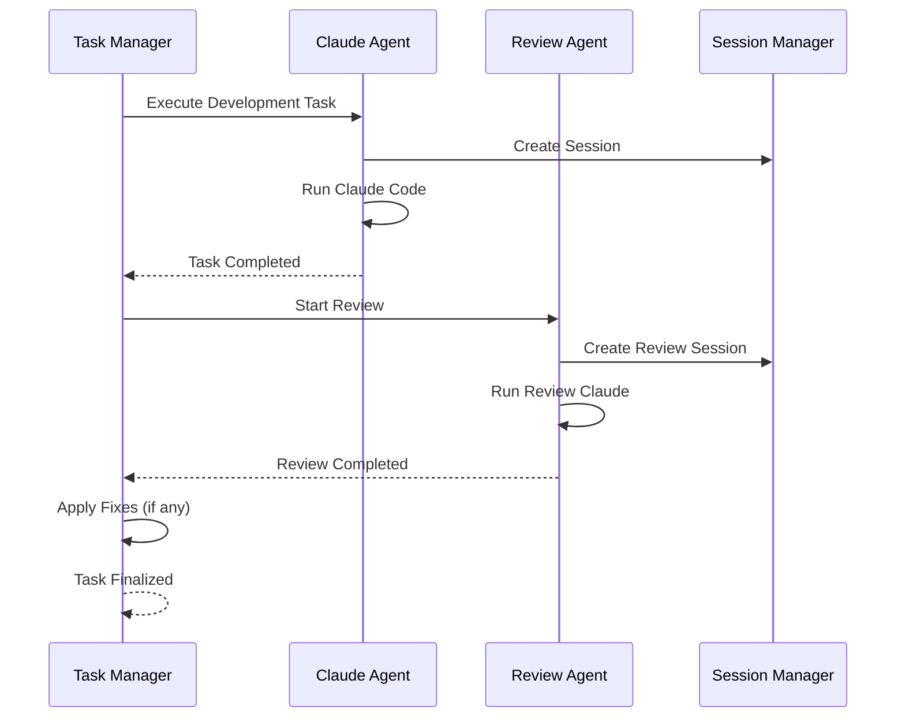

# Claude Task Queue Design

## Overview

Design for an automated task queue system with Claude Code integration. This system enables developers to leverage idle time (such as during sleep) to automatically execute tasks with Claude Code and complete code reviews.

The design is Claude Code-focused while maintaining extensibility for future AI agents (Cursor, GitHub Copilot, etc.).

## Core Concepts

### Claude Code-Focused Design

- **Dedicated Commands**: All functionality provided through `gwq claude` subcommands
- **Automatic Review**: Automatically execute code reviews upon task completion
- **tmux Integration**: Process persistence using tmux session management
- **Parallelism Control**: System-wide Claude Code parallel execution control

### Future Extensibility

```go
// Agent interface for future extensibility
type Agent interface {
    Name() string
    Execute(ctx context.Context, task *Task) (*Result, error)
    HealthCheck() error
    Capabilities() []Capability
}

// Claude Code implementation
type ClaudeAgent struct {
    config *ClaudeConfig
    session *tmux.Session
}

// Future agents
type CursorAgent struct { /* ... */ }
type CopilotAgent struct { /* ... */ }
```

## Architecture

### Overall Structure



### Data Model

```go
type Task struct {
    ID           string            `json:"id"`
    Name         string            `json:"name"`
    Description  string            `json:"description"`
    Branch       string            `json:"branch"`
    Priority     Priority          `json:"priority"`
    Status       Status            `json:"status"`
    CreatedAt    time.Time         `json:"created_at"`
    StartedAt    *time.Time        `json:"started_at,omitempty"`
    CompletedAt  *time.Time        `json:"completed_at,omitempty"`
    WorktreePath string            `json:"worktree_path,omitempty"`
    SessionID    string            `json:"session_id,omitempty"`
    AgentType    string            `json:"agent_type"`
    Result       *TaskResult       `json:"result,omitempty"`
    ReviewResult *ReviewResult     `json:"review_result,omitempty"`
}

type Priority int
const (
    PriorityLow    Priority = 0
    PriorityNormal Priority = 1
    PriorityHigh   Priority = 2
    PriorityUrgent Priority = 3
)

type Status string
const (
    StatusPending     Status = "pending"
    StatusRunning     Status = "running"
    StatusReviewing   Status = "reviewing"
    StatusCompleted   Status = "completed"
    StatusFailed      Status = "failed"
)

type TaskResult struct {
    ExitCode     int              `json:"exit_code"`
    Duration     time.Duration    `json:"duration"`
    FilesChanged []string         `json:"files_changed"`
    CommitHash   string           `json:"commit_hash,omitempty"`
}

type ReviewResult struct {
    Issues       []ReviewIssue    `json:"issues"`
    FixesApplied []string         `json:"fixes_applied"`
    Summary      string           `json:"summary"`
}
```

## Command Design

### gwq claude subcommands

#### `gwq claude task`

Task management functionality (following existing patterns):

```bash
# Add tasks
gwq claude task add -b feature/auth "Authentication system implementation"
gwq claude task add -b feature/api "REST API implementation" -p high
gwq claude task add -f tasks.yaml  # Batch registration from YAML

# Task list (status command pattern)
gwq claude task list

# Output:
# TASK          BRANCH        STATUS      PRIORITY   DURATION
# ● auth-impl   feature/auth  running     normal     45m
#   api-dev     feature/api   pending     high       -
#   bug-fix     bugfix/login  completed   urgent     2h 15m

# Detailed information
gwq claude task list --verbose
gwq claude task list --json
gwq claude task list --csv

# Filter and sort
gwq claude task list --filter running
gwq claude task list --sort priority --reverse

# Real-time monitoring
gwq claude task list --watch

# Specific task details
gwq claude task show auth-impl
gwq claude task show auth  # Pattern matching
gwq claude task show       # Fuzzy finder
```

#### `gwq claude worker`

Worker management:

```bash
# Start worker
gwq claude worker start
gwq claude worker start --parallel 3

# Check worker status
gwq claude worker status

# Output:
# Worker Status: Running
# Active Tasks: 2/3
# Queue: 5 pending
# Sessions: 2 running, 1 reviewing

# Stop worker
gwq claude worker stop

# Check configuration
gwq claude worker config
```

#### `gwq claude tmux`

tmux session management (delegates to generic tmux commands):

```bash
# Session list (filtered for Claude sessions)
gwq tmux list --context claude

# Attach to Claude session (pattern matching)
gwq tmux attach claude-auth
gwq tmux attach --context claude  # Fuzzy finder for Claude sessions

# Terminate Claude session
gwq tmux kill claude-auth
gwq tmux kill --context claude --status completed
```

#### `gwq claude review`

Review functionality:

```bash
# Check review results
gwq claude review show auth-impl

# Output:
# Review Summary for auth-impl:
# Status: Completed
# Issues Found: 3 (1 error, 2 warnings)
# Fixes Applied: 2
# 
# Issues:
# [ERROR] auth.go:45 - SQL injection vulnerability
# [WARN]  auth.go:78 - Missing error handling
# [INFO]  auth_test.go:23 - Test coverage improvement

# Review list
gwq claude review list
gwq claude review list --filter error

# Manual review execution
gwq claude review run auth-impl
```

#### `gwq claude start/stop`

Direct execution commands:

```bash
# Start Claude in current worktree
gwq claude start
gwq claude start --task "Please fix bugs"

# Specify worktree with pattern matching
gwq claude start -w feature/auth --task "Authentication system implementation"

# Background execution
gwq claude start --background --task "Add tests"

# List running Claude instances
gwq claude list

# Output:
# TASK         WORKTREE        STATUS     DURATION   SESSION
# auth-impl    feature/auth    running    45m        attached
# api-dev      feature/api     idle       1h 20m     detached

# Stop Claude
gwq claude stop auth
gwq claude stop --all
```

## Automatic Review Feature

### Review Flow



### Review Configuration

```toml
[claude.review]
# Enable automatic review
enabled = true

# Review targets
review_patterns = ["*.go", "*.js", "*.ts", "*.py"]
exclude_patterns = ["*_test.go", "vendor/*"]

# Review prompt
review_prompt = """
Please focus on reviewing the following points:
1. Security vulnerabilities
2. Bugs and potential issues
3. Performance concerns
4. Code readability
5. Missing tests

If fixes are needed, please apply them automatically.
"""

# Automatic fixes
auto_fix = true
max_fix_attempts = 3
```

## Parallelism Control and Resource Management

### Global Parallelism Control

```go
type ResourceManager struct {
    maxClaude          int
    maxDevelopment     int  
    maxReview         int
    activeDevelopment int
    activeReview      int
    semaphore         *Semaphore
}

func (r *ResourceManager) AcquireSlot(taskType TaskType) (*Slot, error) {
    switch taskType {
    case TaskTypeDevelopment:
        if r.activeDevelopment >= r.maxDevelopment {
            return nil, ErrSlotUnavailable
        }
    case TaskTypeReview:
        if r.activeReview >= r.maxReview {
            return nil, ErrSlotUnavailable
        }
    }
    return r.semaphore.Acquire(), nil
}
```

### Configuration

```toml
[claude]
# Claude Code executable
executable = "claude"
default_args = []

# Global parallelism control
max_parallel = 5
max_development_tasks = 3
max_review_tasks = 2

# Resource limits
max_cpu_percent = 80
max_memory_mb = 4096
task_timeout = "2h"

[claude.queue]
# Queue management
max_queue_size = 100
queue_dir = "~/.gwq/claude/queue"

# Priority processing
priority_boost_after = "1h"
starvation_prevention = true

[claude.tmux]
# tmux session configuration
auto_create_session = true
session_prefix = "gwq-claude"
history_limit = 50000
```

## Agent Abstraction Design

### Agent Interface

```go
// Agent abstraction for future extensions
type Agent interface {
    // Basic information
    Name() string
    Version() string
    Capabilities() []Capability
    
    // Task execution
    Execute(ctx context.Context, task *Task) (*TaskResult, error)
    Review(ctx context.Context, task *Task) (*ReviewResult, error)
    
    // Health check
    HealthCheck() error
    IsAvailable() bool
    
    // Session management
    CreateSession(task *Task) (*Session, error)
    AttachSession(sessionID string) error
}

type Capability string

const (
    CapabilityCodeGeneration Capability = "code_generation"
    CapabilityCodeReview     Capability = "code_review"
    CapabilityTesting        Capability = "testing"
    CapabilityRefactoring    Capability = "refactoring"
    CapabilityDocumentation  Capability = "documentation"
)

// Claude Code implementation
type ClaudeAgent struct {
    config      *ClaudeConfig
    sessionMgr  *SessionManager
    resourceMgr *ResourceManager
}

func (c *ClaudeAgent) Name() string { return "claude" }
func (c *ClaudeAgent) Capabilities() []Capability {
    return []Capability{
        CapabilityCodeGeneration,
        CapabilityCodeReview,
        CapabilityTesting,
        CapabilityRefactoring,
        CapabilityDocumentation,
    }
}
```

### Future Extension Examples

```bash
# Future support for other agents
gwq cursor task add -b feature/ui "UI implementation"
gwq copilot task add -b feature/api "API implementation"

# Agent-specific features
gwq claude review run task-123
gwq cursor pair-programming start
gwq copilot suggest improvements

# Integrated view
gwq agent list
gwq agent status --all
```

## Integration and Workflow

### Integration with Existing Commands

```bash
# Create task when creating worktree
gwq add -b feature/auth --with-task "Authentication system implementation"

# Display Claude information in status command
gwq status --verbose

# Output:
# BRANCH          STATUS    CHANGES        ACTIVITY      CLAUDE
# ● main          clean     -             2 hours ago   -
#   feature/auth  changed   5 added, 3 mod running       auth-impl
#   feature/api   clean     -             pending       api-dev (queued)
```

### Task File Format

```yaml
# tasks.yaml
tasks:
  - name: "Authentication system implementation"
    branch: "feature/auth"
    priority: high
    description: |
      Complete JWT authentication system implementation:
      - Login/logout functionality
      - Token management
      - Permission checks
      - Add tests
    with_review: true
    
  - name: "API specification implementation"
    branch: "feature/api"  
    priority: normal
    description: |
      REST API implementation based on OpenAPI specification:
      - Create endpoints
      - Add validation
      - Error handling
      - Update documentation
    with_review: true
```

## Usage Examples

### Daily Development Flow

```bash
# Morning work preparation
gwq claude task add -b feature/auth "Authentication system implementation" 
gwq claude task add -b feature/api "API implementation" -p high
gwq claude task add -f evening-tasks.yaml

# Start worker
gwq claude worker start --parallel 2

# Check work status
gwq claude task list --watch

# Monitor sessions
gwq claude tmux list

# Evening, check review results
gwq claude review list
gwq claude review show auth --verbose

# Next morning, check completed tasks
gwq claude task list --filter completed
gwq status --verbose
```

### Error Handling Flow

```bash
# Check failed tasks
gwq claude task list --filter failed

# Check session directly for debugging
gwq claude tmux attach auth-impl

# Retry after manual fixes
gwq claude task retry auth-impl

# Check session directly
gwq claude tmux attach auth-impl
```

## Benefits

1. **Effective Time Utilization**: Automated development during sleep
2. **Quality Assurance**: Quality improvement through automatic reviews
3. **Efficient Parallel Processing**: Maximum resource utilization
4. **Integrated Management**: Complete functionality in a single command system
5. **Extensibility**: Future support for other agents
6. **UX Consistency**: Maintains gwq usability

## Limitations

1. Requires Claude Code execution environment
2. Requires tmux installation
3. Requires network connection
4. Important to manage resource usage

## Summary

This design enables gwq to function as a Claude Code-focused automated development platform, effectively utilizing developer idle time. The design considers future extensibility and can support other AI agents.

## Related Documentation

- [DESIGN_TMUX_SESSION.md](./DESIGN_TMUX_SESSION.md) - Generic tmux session management foundation